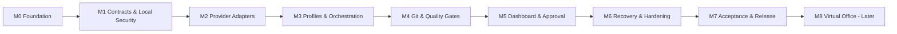

# Orion Console Implementation Roadmap & Release Checklist

> 문서 버전: 1.0  
> 작성일: 2026-07-20  
> 원칙: 날짜가 아니라 검증 가능한 진입·종료 조건으로 진행

## 1. 실행 원칙

- 각 Milestone은 독립적으로 데모·검증 가능해야 한다.
- 다음 Milestone은 이전 종료 게이트를 통과한 후 시작한다.
- 실제 모델 호출보다 fake adapter와 fixture를 먼저 완성한다.
- 보안·Git 격리·상태 일관성은 기능 편의보다 우선한다.
- 18개 프로필을 모두 seed하되 구현 초기 end-to-end는 Orion·Nexus·Archon·Forge·Verify·Sentinel로 검증한다.
- 2D 가상 오피스는 v1 출시 이후에만 착수한다.

## 2. Workstream

| Workstream | 책임 역할 | 주요 산출물 |
|---|---|---|
| Product & UX | Nexus, Iris | 요구사항, 화면, 인수 기준 |
| Architecture | Archon | 모듈·데이터·통합 결정 |
| Backend | Forge | API, DB, scheduler, adapters |
| Frontend | Luma | dashboard, DAG, log, approvals |
| Platform | Keystone | start, runtime, logs, recovery |
| Functional QA | Verify | contract·integration·E2E |
| Security QA | Sentinel | permission·path·approval·classification |
| Orchestration | Orion | 계획·라우팅·최종 종합 |

## 3. Milestone 개요

## 4. M0 — Foundation

### 목표

clean install과 한 명령 개발 실행이 가능한 TypeScript 모노레포를 만든다.

### 구현 범위

- pnpm workspace, TypeScript strict
- React/Vite, Fastify, contracts package
- Vitest, Playwright, lint, typecheck, build scripts
- Pino, config loader, runtime directory abstraction
- README 개발 시작 절차
- Arca는 M0에서 문서·명세·로드맵 계약만 유지한다. registry, DB/FTS5, connector, search, profile seed·실행, Agent 실행, scheduler, audit 또는 source repository 접근·변경을 M0으로 이동하지 않으며 health는 Arca/DB/scheduler/retention을 운영 상태로 표시하지 않는다.

### 산출물

- 실행 가능한 빈 dashboard와 `/api/v1/health`
- 기본 test pipeline
- ADR-001~004 반영

### 진입 조건

- Node 24, pnpm, Git, 두 CLI 설치 상태 확인

### 종료 게이트

- clean install 성공
- `pnpm dev`, `pnpm build`, `pnpm test`, `pnpm typecheck` 성공
- 서버는 127.0.0.1에만 bind
- 기본 browser open 동작
### Arca M1-M5 바인딩 구현 배치
M0의 Arca 범위는 위 문서 계약뿐이며, 다음 배치는 M1-M5에서만 순서대로 구현하고 각 종료 증거를 충족해야 한다.

| Milestone | Arca 구현 배치와 종료 증거 |
|---|---|
| M1 — Contracts, DB & Local Security | Strict SourceCard/SourceRequest/`register_source` schema, metadataVersion·referential·lifecycle 불변조건, SQLite migration, metadata-only repository와 FTS5 schema를 구현한다. 정확히 네 classification을 검증하고 `restricted` 입력은 사용자가 `controlled`를 명시 선택하도록 하며, authorization-before-search/non-disclosure/timing/no-side-effect 계약 테스트, controlled remote-transfer block, raw-excerpt persistence guard와 security contract test를 통과한다. |
| M2 — Provider Adapters | 향후 model handoff의 classification/provider transfer-policy enforcement seam을 구현하고 fake-process fixture로 controlled summary/excerpt가 원격 경계를 넘지 않음을 증명한다. Arca의 default/fallback에 Fable을 사용하지 않는다. |
| M3 — Profiles, Orion & Scheduler | 18번째 Arca profile과 Full SOUL의 strict-parse/seed/version/hash를 검증한다. `knowledge-registry` permission-template ceiling, 허용/금지 operation, approval-bound archive, connector/network boundary, Nexus·specialist typed invocation이 requester/purpose authorization을 자동 우회하지 않음을 검증한다. |
| M4 — Git Isolation & Quality Gates | local-folder와 registered-Git read connector, canonical path·symlink/junction allowed-root test, immutable source repository, freshness/lifecycle/audit 검증을 격리된 quality gate로 구현한다. |
| M5 — Dashboard & Approval Control Plane | registry/search/detail/request/lifecycle/audit UI/API를 연결하고, `restricted` classification 명시 선택 UX, source-specific generic not-found/empty non-disclosure와 source-independent scope 처리만, purpose/range excerpt UX, E2E·접근성 증거를 제공한다. |

## 5. M1 — Contracts, DB & Local Security

### 목표

공통 타입, SQLite, 상태 머신, 로컬 세션, 프로젝트 등록을 완성한다.

### 구현 범위

- Zod contracts와 OpenAPI generation
- SQLite migration, WAL, repositories
- Task·Step·Run 상태 머신과 append-only events
- bootstrap token, cookie, CSRF, Origin·Host 검사
- Git project validation, classification, provider policy
- 18개 AgentProfile seed skeleton

### 의존성

- M0
- API/Event Contract, Security Model

### 종료 게이트

- migration 신규·재실행 테스트
- 불법 상태 전이 저장 불가
- 외부 Host·Origin 요청 거부
- dirty 기준 저장소 무변경
- controlled project plan/start 차단

## 6. M2 — Provider Adapters

### 목표

Codex·Claude를 공통 RunEvent와 RunResult로 실행·취소·재개한다.

### 구현 범위

- fake process adapter
- Codex JSONL parser
- Claude stream-json parser
- ProviderHealth, version·login inspection
- process environment allowlist
- session persistence, cancel, timeout
- SSE replay와 log masking

### 종료 게이트

- 모든 provider fixture contract test 통과
- chunk·invalid JSON·stderr flood·unknown event 처리
- exit 0 + final schema 없음 실패 처리
- process cancel 후 자식 누수 0
- opt-in read-only smoke 각각 1회 성공

## 7. M3 — Profiles, Orion & Scheduler

### 목표

18개 프로필을 실행 가능하게 하고 자연어 목표를 검증된 DAG로 자동 실행한다.

### 구현 범위

- 전체 Description·SOUL·모델·fallback·권한 seed
- profile version·hash·import/export
- Orion structured plan prompt
- DAG·권한·필수 게이트 validator
- 8-slot scheduler, provider soft cap, write cap
- resource governor
- retry·fallback·120분·60회 hard limit
- Agent Workforce 도메인·backend·headless API(아래 배치표 참조)

### 종료 게이트

- 18개 profile round-trip
- 과거 Run snapshot 불변
- 1,000회 scheduler simulation invariant 0
- 코드·코팅·규제·재무 필수 역할 규칙 통과
- cycle·unknown agent·권한 초과 계획 거부
- 모델 fallback 이력 저장
- Agent Workforce 수용 기준 `WFM-001`~`WFM-032` 전수 통과
- workforce UI·무승인 자동화 부재 측정: web 소스와 route registry에 workforce 컴포넌트·라우트 0건, 승인 없이 `active`로 전이시키는 코드 경로 0건, standing delegation·자동 승인 설정 키 0건

### Agent Workforce 배치

| 배치 | 범위 |
|---|---|
| M3 — 도메인·backend·headless API | 데이터 계약, migration 0007, repository·도메인 service, headless API, Default/Override 모델 정책, SOUL/HARNESS 버전·hash·스냅샷, 사용자 직접 고용·해고·재고용 backend, HireProposal backend와 fake manager fixture, planner·validator·scheduler의 active roster 연동, 감사 로그, 보안 fixture. 실제 모델 기반 제안 생성은 하지 않고 결정론적 fake fixture만 사용한다. |
| M5 — 관리 UI와 Approval Center | 고용·해고·재고용 버튼, 에이전트 생성 wizard, 모델 선택 dropdown과 Default/Override 표시, SOUL/HARNESS Markdown 편집기, version diff UI, HireProposal 승인 UX와 Approval Center 연결. |
| M5 이후 — 제한된 상시 위임 | 최고관리 에이전트의 실제 모델 기반 프로필 생성, 사전 승인 한도 안의 자동 활성화(bounded standing delegation), 비용·인원·provider 제한 정책. 별도 정책 정의와 승인을 요구하며 M3·M5의 "승인 없는 활성화 0건" 원칙을 대체하지 않는다. |

## 8. M4 — Git Isolation & Quality Gates

### 목표

병렬 변경을 격리하고 QA·통합을 자동 완료한다.

### 구현 범위

- app-owned worktree·branch lifecycle
- Builder local commit
- Verify·Sentinel gate
- Archon integration worktree·cherry-pick
- conflict resolution 최대 2회
- project verify commands
- 7일 worktree retention

### 종료 게이트

- 4개 병렬 write 후 통합 성공
- 기준 저장소 HEAD/index/files 무변경
- 충돌·중단·dirty worktree 보존
- QA 실패 commit 통합 완료 차단
- app root 밖 정리 불가

## 9. M5 — Dashboard & Approval Control Plane

### 목표

터미널 없이 전체 작업을 운영하고 외부 변경을 승인 제어한다.

### 구현 범위

- dashboard, project, task, agent, approval, artifact, settings
- React Flow DAG와 100k log virtualization
- provider·slot·resource 상태
- profile editor·version diff
- ApprovalRequest, action hash, 30분 expiry
- 제한된 ExternalActionHandler
- 한국어 요약·원문 로그 분리
- Agent Workforce 관리 UI: 고용·해고·재고용 버튼, 에이전트 생성 wizard, 모델 선택 dropdown과 Default/Override 표시, SOUL/HARNESS 편집기와 version diff, HireProposal 승인 UX

### 종료 게이트

- 프로젝트 등록→과제→결과 E2E
- SSE 재연결 중복·누락 0
- 승인 전 push·PR·deploy 차단
- SHA 변경 후 기존 승인 무효
- axe Critical 0
- 100k log 성능 기준 충족
- 고용·해고·재고용과 제안 승인·거절을 UI에서 수행 가능하고, 승인 전 활성화·spawn 0이 UI 경로에서도 유지됨

## 10. M6 — Recovery, Retention & Hardening

### 목표

장시간 자동 운영과 장애·삭제를 안전하게 처리한다.

### 구현 범위

- startup recovery, interrupted run
- 90일 retention·즉시 삭제
- orphan worktree detection
- health·audit·operator alerts
- security attack fixtures
- CLI version capability probe
- dependency license·SBOM 생성

### 종료 게이트

- 서버 강제 종료 후 데이터 손실·중복 run 0
- 91일 데이터와 worktree 예외 정확히 삭제
- secret 마스킹 테스트 통과
- path·command·CSRF·approval 공격 테스트 통과
- Critical/High 보안 결함 0

## 11. M7 — Acceptance & Release

### 목표

실제 업무 시나리오를 반복 성공시키고 내부 사용 가능한 v1을 배포한다.

### 종합 시나리오

- 풀스택 기능 구현
- 경영·무기도료 의사결정
- 모델 장애·fallback·서버 재시작
- 외부 승인·SHA 변경·중복 방지
- controlled 자료 실행 차단

### 종료 게이트

- 각 시나리오 3회 연속 성공
- P0 E2E 100%
- 핵심 coverage 80% 이상
- 최종 평가 90점 이상
- 운영·복구·문제 해결 문서 완료
- 필수 실패 조건 0

## 12. M8 — 2D Virtual Office, 후속

### 착수 조건

- M7 통과
- SSE·Agent 상태 계약 안정
- 대시보드 회귀 테스트 확보

### 범위

- Phaser/Canvas 2D office
- Agent state→위치 매핑
- avatar click→기존 Run detail
- 별도 Office view

### 제외

- 3D, 음성, 멀티플레이, 원격 모바일, 키보드 아바타 이동

## 13. 작업 패키지 의존성

| Package | 선행 | 병렬 가능 |
|---|---|---|
| Contracts/DB | M0 | UI shell과 가능 |
| Local Security/Project | Contracts | Agent seed와 가능 |
| Fake Adapter | Contracts | UI shell과 가능 |
| Real Adapters | Fake Adapter | Codex·Claude 각각 병렬 |
| Profile System | DB | Real adapters와 가능 |
| Planner/Validator | Profiles | Scheduler 일부와 가능 |
| Scheduler | DB·Adapters | UI task view와 가능 |
| Worktree | Project·Scheduler | QA fixtures와 가능 |
| Dashboard | API·SSE contracts | Backend와 병렬 |
| Approval | Security·DB | Dashboard 일부와 병렬 |
| Recovery | DB·Scheduler·Worktree | Hardening tests와 병렬 |

## 14. 변경 관리

- PRD 범위 변경은 PRD version과 Nexus 검토가 필요하다.
- 아키텍처 선택 변경은 ADR 추가 또는 기존 ADR supersede가 필요하다.
- API·event breaking change는 major schemaVersion을 올린다.
- Agent SOUL·HARNESS·모델·권한 변경은 profile version을 올린다. 고용 상태 변경은 version을 올리지 않는다.
- 자료 등급·승인 정책 완화는 Sentinel·Regula 검토와 사용자 승인이 필요하다.
- `MAX_REGISTERED_AGENTS` 상향과 상시 위임 도입은 설정 변경과 별도 사용자 승인이 필요하다.

## 15. 릴리스 체크리스트

### Build

- [ ] clean install·typecheck·lint·unit·integration·E2E·build 성공
- [ ] 실제 모델 호출 없는 기본 검증 확인
- [ ] dependency lock과 SBOM 생성
- [ ] runtime data가 배포물·Git에 포함되지 않음

### Functional

- [ ] 18개 프로필 활성화·편집·import/export
- [ ] custom 에이전트 고용·해고·재고용과 승인 없는 활성화 0건
- [ ] Orion plan·validator·8-slot scheduler
- [ ] Codex·Claude stream·cancel·resume
- [ ] Git worktree·QA·통합
- [ ] 승인·artifact·audit
- [ ] 120분·60회·재시도 2회

### Security

- [ ] loopback 전용
- [ ] path·command·CSRF·approval 테스트 통과
- [ ] controlled 차단·confidential 정책
- [ ] secret 마스킹
- [ ] 기준 저장소 무변경
- [ ] Critical/High 0

### Operations

- [ ] restart recovery
- [ ] 90일 retention·즉시 삭제
- [ ] worktree 7일 정리·예외
- [ ] provider troubleshooting
- [ ] backup·restore 절차 검증

### Acceptance

- [ ] 종합 시나리오 각 3회 성공
- [ ] 최종 점수 90점 이상
- [ ] 잔여 Medium/Low 위험 기록·승인
- [ ] evaluation report와 증거 package 보존

## 16. 롤백 기준

다음 상황에서는 현재 release를 사용 중지하고 이전 검증 version으로 돌아간다.

- 기준 저장소 변경·삭제
- 승인 없는 외부 action
- controlled 자료 전송
- 반복 중복 run·push
- DB migration으로 인한 task·audit 손실
- CLI adapter가 이벤트를 잘못 성공 처리

롤백은 application code와 DB backup을 함께 대상으로 하며 worktree는 자동 삭제하지 않는다.

