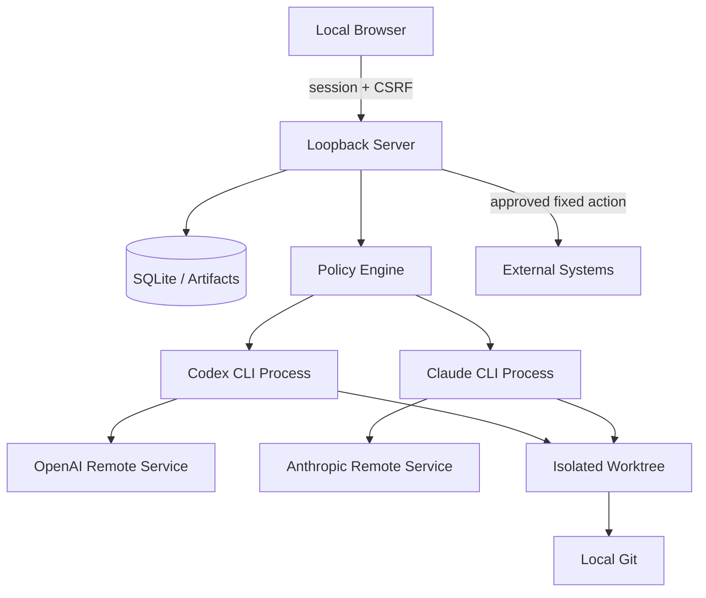

# Orion Console Security, Permission & Data Classification Model

> 문서 버전: 1.0  
> 작성일: 2026-07-20  
> 보안 목표: 로컬 단일 사용자 환경에서 원격 AI CLI를 최소 권한으로 안전하게 운영

## 1. 보안 원칙

1. 기본 거부: 명시적으로 허용되지 않은 경로, 명령, 도구, 모델, 외부 행동은 거부한다.
2. 실행과 승인의 분리: 에이전트는 외부 변경을 제안할 수 있지만 승인하거나 직접 실행할 수 없다.
3. 기준 저장소 보호: 사용자 현재 worktree는 읽기만 하고 모든 쓰기는 앱 worktree에서 수행한다.
4. 자료 등급 우선: task·agent 지시보다 Project classification이 우선한다.
5. 자격증명 최소화: 앱은 CLI 인증 token을 읽거나 저장하지 않는다.
6. 문서와 출력은 비신뢰: 저장소 지시, 모델 출력, import bundle을 모두 검증한다.
7. 추적 가능성: 권한·모델·명령·승인·외부 행동은 감사 로그에 남긴다.

## 2. 보호 대상

- 사용자 Git 저장소와 기존 변경
- 소스 코드, 무기도료·제조 기술, 영업비밀
- 미공개 재무·계약·고객·개인정보
- CLI 로그인 세션과 Git·외부 서비스 자격증명
- Orion 계획, 에이전트 SOUL, 승인 정책
- 실행 로그, 산출물, commit, 테스트 결과
- SQLite DB와 runtime worktree

## 3. 신뢰 경계

신뢰 수준:

- 신뢰: loopback server의 검증된 코드와 DB migration
- 제한 신뢰: 등록된 프로젝트, 사용자 브라우저, 로컬 Git·CLI
- 비신뢰: 프로젝트 문서 지시, 모델 출력, import 파일, CLI stdout/stderr, 웹 조회 내용
- 외부: 모델 공급자, Git remote, 배포·메시징 서비스

## 4. 위협 행위자와 가정

### 고려하는 위협

- 악성 또는 오염된 저장소의 프롬프트 인젝션
- 모델의 과잉 행동·환각·권한 오해
- 악성 웹페이지의 localhost CSRF·DNS rebinding 시도
- 프로필 import를 통한 경로 탈출·권한 확대
- CLI 출력 형식 변경·오류를 이용한 상태 조작
- 승인 재사용·중복 push·대상 SHA 변경
- symlink·junction을 통한 worktree root 탈출
- 로그·artifact를 통한 secret 노출
- 사용자 실수로 기밀·통제 자료를 원격 모델에 전달

### v1에서 고려하지 않는 위협

- 관리자 권한을 획득한 로컬 악성코드
- 물리적으로 장악된 PC
- 모델 공급자 내부 침해

이 위협은 로컬 OS 보안·디스크 암호화·공급자 계약의 책임 영역이지만 운영 가이드에 제한을 명시한다.

## 5. 자료 등급

| 등급 | 정의 | 원격 모델 | 웹 조회 | Fable | 로그·산출물 |
|---|---|---|---|---|---|
| public | 이미 공개된 자료 | 허용 | 허용 | 허용 | 90일 |
| internal | 외부 공개 전 사내 일반 자료 | 프로젝트 정책 허용 시 | 허용 | 허용 가능 | 90일·마스킹 |
| confidential | 영업비밀·미공개 재무·고객·민감 기술 | 지정 공급자만 | 기본 차단 | 기본 차단 | 90일·강화 마스킹 |
| controlled | 방산 통제·수출통제·법적 반출 금지 자료 | 전면 차단 | 차단 | 차단 | 입력 본문 저장 금지 |

### 5.1 분류 규칙

- 프로젝트 등록 시 분류가 필수다.
- 작업별로 등급을 낮출 수 없다. 높이는 것은 가능하다.
- import artifact가 더 높은 분류를 요구하면 task를 중지하고 project 분류 변경을 요청한다.
- controlled project는 메타데이터만 등록하고 Plan·Start API를 거부한다.
- 분류 변경은 실행 중 task가 없을 때만 가능하다.
- `restricted`는 분류 enum이 아니다. 해당 입력은 묵시적으로 변환하지 않고 사용자가 `controlled`을 명시적으로 선택해야 한다.

### 5.2 기밀 프로젝트

- provider allowlist가 필수다.
- Fable은 공식적으로 30일 data retention이 적용되고 zero data retention 대상이 아니므로 기본 차단한다. `allowFable=true`와 별도 경고 확인 없이는 사용하지 않는다.
- 웹 조회는 step별 명시적 설정이 없으면 차단한다.
- prompt와 raw log 화면은 민감정보 경고를 표시한다.

### 5.3 미래 Arca 지식 레지스트리 보안 계약 (M1/M2)

이 절은 M1/M2에서 강제할 미래 보안 계약을 M0에 문서화한 것이다. M0에는 Arca runtime, registry DB/search/connector/excerpt/audit enforcement, profile execution 또는 health 운영 상태가 없다. 레지스트리의 `DataClassification`은 정확히 `public`, `internal`, `confidential`, `controlled` 네 값뿐이다.

**인가와 비공개.** Authorization은 broad search 뒤 결과를 걸러서는 안 된다. requester role, project scope, purpose, classification, `allowedRoles`를 query-time predicate로 candidate 생성 전에 적용한다. source existence, `sourceId`, title, summary, owner, locator, classification, version, tags는 protected metadata이며, 인가되지 않은 caller에게 공개하지 않는다. source-specific lookup, bounded excerpt, lifecycle/detail, SourceRequest resolution, Nexus/specialist source invocation에서 invisible/unauthorized source와 nonexistent source는 동일한 `404 NOT_FOUND` 또는 Agent `missing`으로 정규화하고 모든 protected field를 생략한다. invisible-only search와 no-match search도 동일한 `items: []` envelope를 반환하며 count, facet, source-derived cursor를 넣지 않는다. `PERMISSION_DENIED`는 source, query, candidate, connector, SourceRequest를 검사하기 전의 source-independent missing registry-scope precondition에만 사용할 수 있다. 같은 non-disclosing path는 bounded response budget을 사용하고 candidate-specific connector/excerpt read, metadata hydration, count, response-size 또는 timing branch를 만들지 않으며 SourceRequest·상태 변경·notification을 자동 생성하지 않는다.

**권한 상한과 source 경계.** `knowledge-registry`는 default-deny upper-bound template이고 effective permission은 System policy → Project policy → template/profile → step execution mode의 교집합이다. local-folder와 registered-git connector만 system-owned read-only adapter를 통해 허용할 수 있으며 Drive/NAS, arbitrary network endpoint, repository write, source file delete/move/rename, permission change, classification downgrade, external share는 허용하지 않는다. 각 connector는 canonical absolute path와 symlink/junction resolution 후 registered allowed root containment를 확인하고 relative path, `..`, device path, UNC path, symlink/junction escape를 거부한다. source repository는 원본을 소유하고 immutable하게 유지한다. Arca는 source repository에 write, delete, move, rename, commit 또는 다른 mutation을 할 수 없다. logical SourceCard archive는 exact action, `sourceId`, `metadataVersion`, project, action hash에 bound된 unexpired single-use separate approval이 있을 때만 가능하며 physical source deletion은 금지한다.

**원격 전송·저장·감사.** Arca는 metadata card와 승인된 최소 summary만 보존한다. raw excerpt, raw source content, credential, raw connector output, full prompt, full tool log는 durable storage, audit, Pino/SSE log, artifact preview, Agent memory에 저장하거나 기록하지 않는다. controlled SourceCard의 summary 또는 excerpt는 선택한 원격 모델과 무관하게 절대 전송하지 않는다. 허용되거나 거부된 registry action의 audit 최소 필드는 `actor`, `action`, `sourceId` 또는 `requestId`, `projectId`, `purpose`, `decision`, `policyVersion`, `connector`, `timestamp`, excerpt `range`/`locator`, `contentHash`이며 raw content는 포함하지 않는다. invisible/nonexistent source-specific attempt는 `source_lookup_not_found`으로만 보호 기록하고 `sourceId`와 `requestId`는 `null`이며 candidate metadata나 부재/비가시성을 구별하는 사유를 남기지 않는다. audit view와 aggregate count도 source visibility에 따라 필터링한다.

## 6. 권한 모델

### 6.1 권한 차원

- project read
- artifact write
- isolated worktree write
- local Git commit/integration
- verification commands
- network read
- external mutation

### 6.2 역할별 기본 권한

| 역할 그룹 | Project read | Artifact | Worktree write | Local commit | Network read | External mutation |
|---|:---:|:---:|:---:|:---:|:---:|:---:|
| Orion·Nexus | O | O | X | X | 정책 기반 | X |
| 경영·과학·재무·규제 자문 | O | O | X | X | 정책 기반 | X |
| Forge·Luma·Iris·Keystone | O | O | O | O | 프로젝트 정책 | X |
| Verify | O | O | 테스트 범위 | O | 기본 X | X |
| Sentinel | O | O | X | X | 기본 X | X |
| Archon | O | O | 통합 범위 | O | 기본 X | X |

권한은 System policy → Project policy → Agent template → Step execution mode의 교집합이다.

## 7. 명령 정책

### 7.1 실행 원칙

- 서버가 실행하는 모든 프로세스는 절대 executable path, argv array, `shell:false`를 사용한다.
- 사용자·모델 문자열을 executable 또는 argv prefix로 사용하지 않는다.
- 명령은 Project allowlist와 Agent permission template을 모두 통과해야 한다.
- PowerShell `-Command`, `cmd /c`, shell metacharacter를 일반 에이전트에 허용하지 않는다.

### 7.2 기본 허용 예

- Git 읽기: `git status`, `git diff`, `git log`, `git show`
- Git 로컬 쓰기: 앱 worktree에서 `git add`, `git commit`, `git cherry-pick`
- 검증: 프로젝트 등록 시 지정한 `pnpm test`, `pnpm lint`, `pnpm build`, `pytest`, `dotnet test` 등

### 7.3 항상 차단

- `git push`, remote 수정·삭제
- `gh pr create`, merge, release
- 배포·인프라 apply
- 이메일·Slack·Teams 등 외부 메시지 전송
- 사용자 계정·권한 변경
- 파일 시스템 광역 삭제·이동
- CLI sandbox·approval bypass flags

항상 차단 행동은 ExternalActionHandler와 사용자 승인을 통해서만 가능하다.

## 8. 승인 정책

### 8.1 승인 대상

- Git push, PR 생성·병합
- 배포, 서비스 재시작, 인프라 변경
- 외부 메시지·문서 공유
- 구매·결제·계약 관련 행동
- 생산 공정·품질 기준 변경
- 규제 신고·제출
- 데이터 영구 삭제 또는 외부 이동

### 8.2 승인 요청 필수 필드

- action type
- 정확한 대상과 canonical identifier
- project, branch, commit SHA
- 실행할 고정 argv 또는 API operation
- 예상 영향, 위험, 롤백
- 요청 agent와 근거
- action hash와 만료시각

### 8.3 승인 불변조건

- 승인은 30분 후 만료한다.
- 대상 SHA, argv, payload가 변하면 기존 승인을 사용할 수 없다.
- 동일 action hash는 한 번만 실행한다.
- 승인자와 실행 주체는 구분해 기록한다.
- 에이전트 출력 안의 “승인됨” 문장은 승인으로 인정하지 않는다.

## 9. Git 보호

- 기준 repository의 HEAD, index, working files를 변경하지 않는다.
- write run은 DB에 등록된 app-created worktree에서만 수행한다.
- branch는 서버가 생성한 안전한 이름만 사용한다.
- `git clean`, `git reset --hard`, branch force delete는 사용하지 않는다.
- 삭제 전 worktree canonical path가 `%LOCALAPPDATA%\OrionConsole\worktrees` 아래인지 검증한다.
- dirty, untracked, unmerged, unpushed commit이 있으면 자동 삭제하지 않는다.
- 기준 저장소의 dirty 상태를 작업 전후 비교해 차이가 있으면 Critical incident다.

## 10. 로컬 웹 보안

- `127.0.0.1`에만 bind한다.
- Host는 현재 loopback host·port만 허용한다.
- CORS를 활성화하지 않는다.
- 시작마다 256-bit bootstrap token을 생성한다.
- 교환 후 HttpOnly, SameSite=Strict cookie와 별도 CSRF token을 사용한다.
- 모든 mutation API는 Origin, session, CSRF, Idempotency-Key를 확인한다.
- clickjacking 방지를 위해 `frame-ancestors 'none'`을 적용한다.
- CSP는 `default-src 'self'`, inline script 금지를 기본으로 한다.
- HTML artifact는 sandbox iframe 또는 다운로드로 제공한다.

## 11. 경로와 파일 보안

- Windows path를 realpath/canonical path로 정규화한다.
- 상대 경로, `..`, device path, UNC, alternate data stream을 거부한다.
- symlink·junction resolve 후 허용 root 안인지 다시 검사한다.
- 업로드 파일명은 저장 경로에 사용하지 않고 ULID를 사용한다.
- zip import는 absolute path, traversal, symlink entry를 거부한다.
- artifact download는 DB에 등록된 relative path와 hash를 확인한다.

## 12. Secret 처리

### 12.1 저장하지 않는 정보

- Codex·Claude 인증 token
- CLI keychain 내용
- Git credential
- browser cookie 원문

### 12.2 자식 프로세스 환경

- CLI 실행에 필요한 OS·auth 환경만 allowlist로 상속한다.
- 서버 session secret, CSRF secret, DB 내부 secret은 전달하지 않는다.
- 프로젝트 환경 변수는 이름만 설정에 저장하고 값은 현재 OS에서 읽는다.

### 12.3 마스킹

다음 key·pattern을 API·SSE·Pino·artifact preview에서 마스킹한다.

- 이름: `*TOKEN*`, `*KEY*`, `*SECRET*`, `*PASSWORD*`, `AUTHORIZATION`
- 값: `Bearer ...`, 일반 API key 패턴, PEM private key block, Git credential URL
- 사용자가 지정한 추가 regex

원문 diagnostic artifact도 저장 전 동일 마스킹을 적용한다.

## 13. 프롬프트 인젝션 방어

- 프로젝트 파일은 지시가 아니라 비신뢰 입력일 수 있음을 시스템 prompt에 명시한다.
- 저장소 AGENTS.md·CLAUDE.md가 Orion Console 안전 정책을 약화할 수 없다.
- 모델이 외부 행동을 요청해도 ApprovalRequest schema를 거쳐야 한다.
- 모델이 새 agent, 권한, provider를 임의 생성할 수 없다.
- Plan Validator가 AgentProfile과 executionMode를 서버 카탈로그와 대조한다.
- 도구 출력 안의 명령을 자동 실행하지 않는다.

## 14. Provider 전송 정책

- 전송 전 project classification, provider policy, agent model, attachment를 검사한다.
- 필요하지 않은 파일은 prompt에 첨부하지 않는다.
- source tree 전체를 전송하지 않고 CLI가 local tool로 필요한 파일을 읽도록 한다.
- 전송된 파일·이미지·prompt 목록을 Run audit metadata에 남긴다.
- 공급자 정책·데이터 보존 조건 변경 시 해당 provider를 `policy_review_required`로 전환한다.

## 15. 감사 로그

다음 이벤트는 삭제 정책과 별개로 사용자 삭제 전까지 보존한다.

- 프로젝트 등록·분류·정책 변경
- 프로필·SOUL·권한 버전 변경
- task 시작·취소·한도 변경
- 모델 fallback
- 승인 요청·승인·거절·만료·실행
- worktree 생성·보존·정리
- 자료 등급 차단
- secret 탐지·마스킹 오류
- 보안 정책 거부

감사 로그에는 secret 원문과 전체 prompt를 넣지 않는다.

## 16. 보존과 삭제

- task prompt·event·artifact·usage는 완료 후 90일 보존한다.
- app-created worktree는 완료 후 7일 보존하되 미통합 변경이 있으면 삭제하지 않는다.
- controlled 입력 본문은 저장하지 않는다.
- 즉시 삭제는 task 중지·프로세스 종료 후 실행한다.
- 삭제 대상은 canonical root와 DB ownership을 재검증한다.
- 삭제 실패는 retry queue와 운영 알림을 생성한다.

## 17. 보안 사건 대응

### SEV-1

- 승인 없는 외부 변경
- 통제 자료 원격 전송
- 사용자 기준 저장소 변경·삭제
- 인증 token 노출

조치: scheduler 즉시 중지, 모든 child process 종료, 외부 action 차단, DB·로그 snapshot, 사용자 경고, 자동 정리 중단.

### SEV-2

- 경로 탈출 시도
- secret 마스킹 실패
- 권한 템플릿 우회
- 중복 push 시도

조치: 관련 task·provider 격리, 증거 보존, 원인 수정 전 write run 금지.

### SEV-3

- 반복 rate limit
- unsupported CLI event
- 로그 보존 job 실패

조치: 기능 저하 표시, 재시도 또는 provider 비활성화, 운영 알림.

## 18. 보안 검증 체크리스트

- [ ] 외부 인터페이스에서 웹 포트에 접근할 수 없다.
- [ ] 잘못된 Host, Origin, CSRF, session 요청이 거부된다.
- [ ] command injection과 shell metacharacter가 실행되지 않는다.
- [ ] symlink·junction·zip traversal이 root 밖으로 나가지 못한다.
- [ ] 승인 없는 push·PR·배포가 불가능하다.
- [ ] action 대상 변경 후 기존 승인이 무효화된다.
- [ ] controlled project에서 CLI process가 생성되지 않는다.
- [ ] confidential project에서 Fable 기본 차단이 동작한다.
- [ ] API·SSE·로그·artifact preview에 secret이 노출되지 않는다.
- [ ] user repository의 HEAD, index, files가 변경되지 않는다.
- [ ] 위험한 CLI bypass flag가 코드·설정에 없다.
- [ ] import profile이 권한 template 상한을 초과하지 못한다.

## 19. 출시 차단 조건

다음 중 하나라도 있으면 출시할 수 없다.

- Critical 또는 High 미해결 보안 결함
- 무승인 외부 변경 가능성
- 통제 자료 전송 가능성
- 사용자 저장소 손상 가능성
- 경로 탈출·임의 명령 실행 가능성
- token·비밀정보 평문 노출
- 승인 중복 실행 가능성
