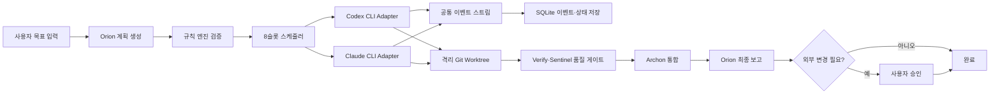

# Orion Console 상세 기술 명세서

> 문서 버전: 1.0  
> 작성일: 2026-07-20  
> 구현 대상: `outputs/orion-console`  
> 관련 문서: `orion-console-prd.md`  
> 기준 환경: Windows 11, Node.js 24.16.0, pnpm 11.15.1, Codex CLI 0.138.0, Claude Code 2.1.156

## 1. 문서 목적

이 문서는 Orion Console v1을 실제로 구현하기 위한 결정 완료형 기술 기준이다. 아키텍처, 기술 스택, 공통 인터페이스, 데이터 모델, 실행·보안·Git 정책, UI 구조, 단계별 구현 목표, 검증 체크리스트와 평가 방법을 정의한다.

구현자는 이 문서와 PRD가 충돌할 경우 PRD의 제품 범위와 안전 원칙을 우선하고, 세부 구현은 이 문서를 따른다.

## 2. 최종 기술 목표

다음 흐름을 사용자 개입 없이 로컬에서 완료하고, 외부 변경 직전에만 승인을 요청하는 시스템을 만든다.



### 2.1 핵심 불변조건

1. 등록된 사용자 기준 저장소의 현재 worktree는 에이전트가 직접 수정하지 않는다.
2. 모든 쓰기 에이전트는 앱이 만든 독립 worktree에서만 실행한다.
3. 외부 변경은 승인 레코드 없이 실행되지 않는다.
4. Orion이 만든 계획은 서버 규칙 검증을 통과해야 실행된다.
5. 한 작업은 120분·에이전트 실행 60회를 초과하지 않는다.
6. 전체 동시 실행은 8개를 초과하지 않는다.
7. 통제 등급 자료는 Codex·Claude 원격 실행으로 전달되지 않는다.
8. 실행 이력은 실제 사용한 프로필·모델·권한의 불변 스냅샷을 가진다.
9. 동일 단계의 중복 실행과 동일 외부 작업의 중복 수행을 방지한다.
10. 앱이 생성하지 않은 Git 브랜치, worktree, 파일은 자동 삭제하지 않는다.

## 3. 기술 스택

### 3.1 애플리케이션 스택

| 영역 | 기술 | 선택 이유 |
|---|---|---|
| 언어 | TypeScript, strict mode | 웹·서버·CLI 이벤트 타입을 공유하고 런타임 오류를 줄임 |
| 패키지 관리 | pnpm workspace | 모노레포 패키지 중복을 줄이고 현재 환경과 일치 |
| 프론트엔드 | React + Vite | 로컬 SPA에 적합하고 개발·빌드가 단순함 |
| 라우팅 | React Router | 프로젝트·과제·프로필·승인 화면 라우팅 |
| 서버 상태 | TanStack Query | REST 캐시, 갱신, 오류·재시도 관리 |
| 작업 그래프 | React Flow | DAG, 단계 상태, 의존성 시각화 |
| UI | Tailwind CSS + shadcn/ui | 접근성 있는 대시보드 컴포넌트를 빠르게 일관화 |
| 대용량 로그 | TanStack Virtual | 100,000건 수준 이벤트 목록 가상화 |
| 백엔드 | Fastify | 낮은 오버헤드, 스키마 중심 REST, 스트리밍 지원 |
| 실시간 전송 | Server-Sent Events(SSE) | 서버→브라우저 단방향 이벤트에 적합하며 재연결이 단순함 |
| 검증 | Zod | API, DB JSON, CLI 이벤트, 프로필 설정 런타임 검증 |
| DB | Node `node:sqlite` | Node 24 기본 모듈로 Windows 네이티브 빌드 의존성 최소화 |
| 로그 | Pino | 구조화 로그와 Fastify 통합 |
| 프로세스 실행 | `node:child_process.spawn` | `shell:false`, stdin, stdout/stderr 스트리밍 제어 |
| ID | ULID | 시간 정렬 가능하고 로그·파일명에 안전한 ID |
| 단위·통합 테스트 | Vitest | TypeScript·Vite 환경과 통합 |
| E2E | Playwright | 브라우저 UI, SSE, 승인 흐름 검증 |
| 접근성 | axe-core | 자동 접근성 검사 |

### 3.2 선택하지 않는 기술

- Electron/Tauri: v1은 브라우저형 로컬 서버이므로 제외한다.
- Next.js: 장기 프로세스·SSE·CLI 실행 서버와 프론트엔드를 명확히 분리하기 위해 사용하지 않는다.
- Docker 필수화: 로컬 CLI 인증과 Windows 프로젝트 접근을 단순하게 유지하기 위해 필수가 아니다.
- WebSocket: v1 명령은 REST, 실시간 데이터는 SSE로 충분하다.
- 외부 Redis·PostgreSQL: 단일 사용자·로컬 환경에 불필요하다.
- 임의 셸 명령 API: 명령 주입과 권한 오용 위험 때문에 제공하지 않는다.

## 4. 저장소 구조

```text
orion-console/
├─ apps/
│  ├─ server/                 # Fastify, scheduler, CLI adapters, Git, persistence
│  └─ web/                    # React/Vite local dashboard
├─ packages/
│  ├─ contracts/              # Zod schemas and shared TypeScript types
│  ├─ orchestration/          # DAG validation, scheduler policies, state machines
│  ├─ agent-catalog/          # 18 seed profiles and permission templates
│  └─ test-fixtures/          # fake CLI and sanitized JSONL fixtures
├─ migrations/                # ordered SQLite SQL migrations
├─ scripts/                   # start, health check, optional real smoke test
├─ docs/                      # runtime and operator documentation
├─ package.json
├─ pnpm-workspace.yaml
├─ tsconfig.base.json
└─ README.md
```

### 4.1 런타임 데이터 구조

```text
%LOCALAPPDATA%\OrionConsole\
├─ orion.db
├─ logs\
├─ artifacts\<task-id>\
├─ worktrees\<project-id>\<task-id>\<run-id>\
├─ schemas\                 # CLI structured-output 임시 스키마
├─ exports\
└─ runtime.json             # 포트, PID, 시작 시각; 비밀정보 미포함
```

## 5. 프로세스와 모듈 아키텍처

### 5.1 Server Process

단일 Node 서버 프로세스가 다음 모듈을 호스팅한다.

- HTTP API 및 정적 프론트엔드 제공
- SSE 브로커
- SQLite 저장소
- Orion Planner와 Plan Validator
- Scheduler와 Resource Governor
- Codex/Claude CLI Adapter
- Git Worktree Manager
- Approval Service
- Retention·Recovery·Health Service

CLI는 서버의 자식 프로세스로 실행한다. 서버가 재시작되면 기존 자식 프로세스는 재부착하지 않고 DB 상태를 `interrupted`로 전환한다. 저장된 session ID와 Git 상태를 검사해 사용자가 또는 자동 복구 정책이 새 프로세스로 재개한다.

### 5.2 Web Process

개발 모드에서는 Vite 개발 서버를 사용한다. 제품 모드에서는 Fastify가 빌드된 정적 SPA를 제공한다. 앱은 빈 포트에서 시작하되 기본 포트는 `4317`이며, 충돌 시 `4318`부터 순차 탐색해 브라우저를 연다.
M0 제품 모드에서는 `apps/web/dist`를 Fastify가 제공하고, REST base path는 `/api/v1`이다. `/api/v1/*`는 API가 먼저 처리하며, 비 API 탐색 요청만 SPA fallback으로 `index.html`을 반환한다. M0의 `GET /api/v1/health`는 DB·scheduler·retention이 아직 구현되지 않았음을 `not_initialized`로 정직하게 표시한다.

### 5.3 패키지 의존 방향

```text
contracts <- orchestration <- server
contracts <- agent-catalog <- server
contracts <- web
test-fixtures <- server tests
```

`web`은 `server` 내부 모듈을 직접 import하지 않는다. 모든 경계는 `contracts`의 공개 스키마를 사용한다.

## 6. 핵심 도메인 모델

### 6.1 상태 열거형

```ts
type DataClassification = "public" | "internal" | "confidential" | "controlled";

type TaskStatus =
  | "draft"
  | "planning"
  | "queued"
  | "running"
  | "waiting_approval"
  | "succeeded"
  | "failed"
  | "cancelled"
  | "limit_reached";

type StepStatus =
  | "waiting"
  | "ready"
  | "running"
  | "retry_wait"
  | "waiting_approval"
  | "succeeded"
  | "failed"
  | "skipped"
  | "cancelled"
  | "interrupted";

type RunStatus =
  | "starting"
  | "running"
  | "stalled"
  | "succeeded"
  | "failed"
  | "timed_out"
  | "cancelled"
  | "interrupted";
```

### 6.2 Project

```ts
interface Project {
  id: string;
  name: string;
  repositoryPath: string;       // canonical absolute Windows path
  defaultBranch: string;
  classification: DataClassification;
  allowedAgentIds: string[];
  allowedReadCommands: string[];
  allowedWriteCommands: string[];
  providerPolicy: {
    openai: boolean;
    anthropic: boolean;
    allowFable: boolean;
  };
  createdAt: string;
  updatedAt: string;
}
```

등록 조건:

- 경로가 존재하고 `git rev-parse --is-inside-work-tree`가 성공해야 한다.
- canonical path가 중복 등록되지 않아야 한다.
- 기준 브랜치 또는 기준 ref가 존재해야 한다.
- 통제 등급은 등록 가능하지만 원격 LLM 작업 시작은 불가능하다.

### 6.3 AgentProfile

```ts
interface AgentProfile {
  id: string;
  version: number;
  name: string;
  displayName: string;
  description: string;
  soulMarkdown: string;
  provider: "openai" | "anthropic";
  model: string;
  fallbackModels: Array<{ provider: "openai" | "anthropic"; model: string }>;
  reasoningEffort: "low" | "medium" | "high" | "xhigh" | "max";
  permissionTemplate: "orchestrator" | "advisor" | "builder" | "qa_writer" | "reviewer" | "integrator";
  networkReadAllowed: boolean;
  enabled: boolean;
  createdAt: string;
}
```

프로필 수정은 기존 행을 덮어쓰지 않고 version을 증가시킨다. Run은 `agentProfileSnapshot` JSON을 보관한다.

### 6.4 TaskRequest와 OrchestrationPlan

```ts
interface TaskRequest {
  projectId: string;
  title: string;
  objective: string;
  successCriteria: string[];
  inputArtifactIds: string[];
  maxDurationMinutes: number;    // default 120, maximum 120 in v1
  maxAgentRuns: number;          // default 60, maximum 60 in v1
  requestedAgentIds?: string[];
}

interface OrchestrationStep {
  id: string;
  title: string;
  agentId: string;
  dependsOn: string[];
  executionMode: "read_only" | "artifact_write" | "worktree_write" | "integration" | "external_action";
  objective: string;
  inputRefs: string[];
  expectedArtifacts: string[];
  acceptanceCriteria: string[];
  verificationCommands: string[];
  maxAttempts: 1 | 2 | 3;
}

interface OrchestrationPlan {
  taskId: string;
  summary: string;
  assumptions: string[];
  risks: string[];
  steps: OrchestrationStep[];
  finalSynthesisStepId: string;
}
```

### 6.5 RunResult

```ts
interface RunResult {
  status: "succeeded" | "failed" | "needs_attention";
  summary: string;
  findings: Array<{ severity: "info" | "low" | "medium" | "high" | "critical"; text: string; evidence?: string }>;
  artifacts: Array<{ kind: string; path?: string; title: string; description?: string }>;
  changes: Array<{ commitSha?: string; files: string[]; description: string }>;
  tests: Array<{ command: string; status: "passed" | "failed" | "not_run"; summary: string }>;
  risks: string[];
  handoff: string;
}
```

### 6.6 RunEvent

```ts
interface RunEvent {
  id: string;
  sequence: number;
  taskId: string;
  stepId?: string;
  runId?: string;
  provider?: "openai" | "anthropic" | "system";
  type:
    | "task.status"
    | "step.status"
    | "run.started"
    | "run.output.delta"
    | "run.tool.started"
    | "run.tool.completed"
    | "run.usage"
    | "run.retry"
    | "run.model_fallback"
    | "approval.requested"
    | "artifact.created"
    | "git.commit"
    | "test.result"
    | "run.completed"
    | "run.failed"
    | "run.cancelled";
  timestamp: string;
  payload: unknown;
}
```

SSE `id`는 RunEvent sequence를 사용한다. 브라우저 재연결 시 `Last-Event-ID` 이후 이벤트를 DB에서 재생한 뒤 live stream에 연결한다.

### 6.7 Agent Workforce 도메인 (M3)

§6.3의 `AgentProfile`은 기본 내장 18개의 프로필 내용을 기술한다. M3는 여기에 **정체성 · 내용 · 고용 상태** 세 개념을 명시적으로 분리한 workforce 도메인을 추가한다. 세 개념을 하나로 합쳐 다루지 않는다.

```ts
// 불변 신원. 생성 후 UPDATE·DELETE가 없다.
interface AgentDefinition {
  id: string;
  name: string;                 // 생성 시점의 불변 식별 기록
  origin: "builtin" | "user_created" | "manager_proposed" | "imported";
  createdBy: string;
  createdAt: string;
}

// 불변 내용. 변경은 새 version row로만 이루어진다.
interface AgentProfileVersion {
  agentId: string;
  version: number;
  configSha256: string;
  soulSha256: string;
  harnessSha256: string | null;  // HARNESS는 선택 필드
  runtimeSelection: RuntimeSelection;
  origin: "user_created" | "manager_proposed" | "imported";
  createdBy: string;
  createdAt: string;
}

// 가변 고용 상태. "이 에이전트를 계획·실행에 쓸 수 있는가"의 유일한 런타임 권위.
interface AgentEmployment {
  agentId: string;
  state: "draft" | "active" | "suspended" | "retired";
  activeVersion: number | null;      // state==="active"일 때만 non-null
  lastActiveVersion: number | null;
  activatedAt: string | null;
  deactivatedAt: string | null;
  actor: string;
  reason: string | null;
  revision: number;                  // compare-and-swap
  updatedAt: string;
}

interface RuntimeSelection {
  selectionMode: "default" | "override";
  selectionSource: "catalog" | "user" | "manager";
  provider: "openai" | "anthropic";
  model: string;
  reasoningEffort: "low" | "medium" | "high" | "xhigh" | "max";
  fallbackModels: Array<{ provider: "openai" | "anthropic"; model: string }>;
}
```

- 현재 **표시 이름**의 권위는 활성 profile version(미고용이면 최신 version)의 `name`/`displayName`이다. `AgentDefinition.name`은 생성 시점 기록이며 두 값을 혼용하지 않는다.
- `selectionMode: "default"`는 `selectionSource: "catalog"`와만 결합하고, `override`는 `user` 또는 `manager`로만 귀속된다. `RuntimeSelection`에는 권한이 포함되지 않는다. override는 어떤 경우에도 권한 상한을 넓히지 못한다.
- 허용 전이는 7개뿐이다: `draft→active`(hire), `active→suspended`(suspend), `suspended→active`(resume), `active→retired`·`suspended→retired`·`draft→retired`(dismiss), `retired→active`(rehire). 자기 전이를 포함한 나머지 순서쌍은 모두 거부한다.
- `hire`는 활성화할 version이 필수이고 `rehire`는 선택(미지정 시 `lastActiveVersion`)이며, `resume`은 `lastActiveVersion`을 복원한다. **어떤 action도 최신 version으로 자동 승격하지 않는다.**
- 해고는 물리 삭제가 아니다. 정의·version·Run 스냅샷·감사 이력이 모두 남고, 실행 중인 Run을 자동 종료하지도 않는다.
- `suspended`와 `retired`는 모두 신규 Plan 선택 불가·신규 Run 시작 불가다. 차이는 의도(일시적)와 재개 경로뿐이다.

```ts
// 최고관리 에이전트가 작성하는 채용 제안. 그 자체로는 아무것도 활성화하지 않는다.
interface HireProposal {
  id: string;
  requestedBy: string;
  authoredBy: string;              // 최고관리 에이전트 ID
  proposedAgentId: string;
  proposalSha256: string;
  status:
    | "pending_approval"
    | "approved"
    | "rejected"
    | "expired"
    | "activated"
    | "invalidated";
  createdAt: string;
  expiresAt: string;               // 생성 후 30분
  decidedAt: string | null;
  decidedBy: string | null;        // expired는 자동 처리이므로 null
  activatedAgentId: string | null;
  activatedVersion: number | null;
}
```

제안 본문(`proposed_definition_json` / `proposed_profile_json`)과 서버 검증 결과(`validation_json`)는 DB row에 함께 저장한다. 활성화는 `proposalSha256`을 다시 제시한 사용자 승인으로만 이루어지며, 상세 규칙은 Security §8.4를 따른다.

Run과 planning-run 시작 시 profile version, SOUL 본문·hash, HARNESS 본문·hash와 출처(`profile` | `template-default`), 시스템 정책 version, effective provider/model/reasoningEffort, `selectionSource`, permission snapshot을 하나의 immutable snapshot으로 저장한다. 진행 중 Run은 새 version이나 고용 상태 변경의 영향을 받지 않는다.

## 7. SQLite 스키마

### 7.1 테이블

| 테이블 | 주요 컬럼 | 용도 |
|---|---|---|
| `schema_migrations` | version, applied_at | DB 마이그레이션 |
| `projects` | id, name, repository_path, default_branch, classification, policy_json | 프로젝트 설정 |
| `agent_profiles` | id, version, name, config_json, created_at | 버전별 에이전트 프로필 |
| `tasks` | id, project_id, status, objective, criteria_json, limits_json, timestamps | 과제 루트 |
| `task_plans` | task_id, version, plan_json, validation_json | Orion 계획과 검증 결과 |
| `task_steps` | id, task_id, agent_id, status, dependencies_json, config_json | DAG 단계 |
| `runs` | id, step_id, attempt, provider, model, profile_snapshot_json, status, session_id, timestamps | 실제 CLI 실행 |
| `events` | id, sequence, task_id, run_id, type, payload_json, created_at | append-only 공통 이벤트 |
| `artifacts` | id, task_id, run_id, kind, title, relative_path, hash, expires_at | 보고서·패치·로그·파일 |
| `approvals` | id, task_id, action_type, target_json, status, requested_at, decided_at | 외부 변경 승인 |
| `git_worktrees` | id, project_id, task_id, run_id, path, branch, base_sha, status | 앱 생성 worktree 추적 |
| `usage_records` | id, run_id, input_tokens, output_tokens, cache_tokens, duration_ms, reported_cost | 사용량 |
| `audit_log` | id, actor, action, object_type, object_id, detail_json, created_at | 사용자·시스템 감사 기록 |
| `agent_definitions` | id, name, origin, created_by, created_at | 에이전트 불변 신원(built-in 18 + custom) |
| `agent_profile_versions` | agent_id, version, config_sha256, config_json, soul_sha256, harness_sha256, runtime_selection_json, origin, created_by, created_at | custom 에이전트의 불변 프로필 version |
| `agent_employments` | agent_id, state, active_version, last_active_version, activated_at, deactivated_at, actor, reason, revision, updated_at | 에이전트 고용 상태 |
| `hire_proposals` | id, requested_by, authored_by, proposed_agent_id, proposed_definition_json, proposed_profile_json, validation_json, proposal_sha256, status, created_at, expires_at, decided_at, decided_by, activated_agent_id, activated_version | 최고관리 에이전트의 채용 제안과 결정 이력 |

**`audit_log` 컬럼 표기 drift(실측 기록).** 위 표의 `audit_log` 행은 `object_type`, `object_id`, `detail_json`을 적고 있으나, 실제 `migrations/0001_core.sql`이 만든 컬럼은 `id, actor, action, project_id, payload_json, created_at`이며 그 세 컬럼은 **존재하지 않는다**. 이는 관측된 사실로 기록만 하고 이 문서의 기존 표기를 임의로 고쳐 쓰지 않으며, 구현을 문서에 맞추는 `ALTER`도 하지 않는다(0001 불변 원칙). 따라서 workforce 감사 이벤트는 **실측 컬럼만 사용**한다. 에이전트 ID, version, 상태 전이, 제안 ID는 전부 `payload_json` 안에 넣고, 에이전트 범위 이벤트의 `project_id`는 NULL이다. 이 불일치의 해소 여부는 별도 결정 대상으로 남긴다.

### 7.2 DB 규칙

- `events(task_id, sequence)`는 unique이며 sequence는 task별 단조 증가한다.
- 한 step에서 `running` 상태인 run은 하나만 존재하도록 partial unique 제약을 둔다.
- 승인 실행은 `approval_id + action_hash` unique로 중복 외부 실행을 방지한다.
- 프로젝트 canonical path는 unique다.
- AgentProfile의 `(id, version)`은 unique다.
- DB 쓰기는 짧은 transaction으로 수행하고 WAL mode를 사용한다.
- 이벤트 payload와 프로필 snapshot은 Zod 검증 후 저장한다.
- AgentProfile `(id, version)`의 유일성은 두 테이블에 걸쳐 성립한다. `agent_profiles`는 **built-in ID 전용**, `agent_profile_versions`는 **custom ID 전용**이며 두 키 공간이 서로소이므로 union에도 중복이 없다. 두 방향의 침범은 각각 trigger가 거부한다.
- `agent_definitions`와 `agent_profile_versions`는 append-only다. UPDATE와 DELETE는 trigger가 거부한다.
- `active_version`과 `last_active_version`은 origin에 따라 대상 테이블이 갈라지므로 DB FK로 표현하지 않는다. "해당 에이전트의 union version 집합에 존재하는 값인가"는 repository·service 계층이 검증한다.
- 동시 고용 상태 변경은 `agent_employments.revision` compare-and-swap으로 직렬화한다.

### 7.3 Agent Workforce 스키마 (migration 0007, 구현 기준)

`0001~0006`은 수정하지 않고 `0007_m3_agent_workforce.sql`을 forward-only로 추가한다. 기존 `agent_profiles`의 36 rows(v1 skeleton 18 + v2 full 18)와 `config_sha256`, seed 순서는 그대로 보존한다.

**테이블과 제약**

- `agent_definitions`: `origin`은 `builtin | user_created | manager_proposed | imported` CHECK.
- `agent_profile_versions`: PK `(agent_id, version)`, `version >= 1` CHECK, `agent_id`는 `agent_definitions(id)` FK(`ON DELETE RESTRICT`), `harness_sha256`만 nullable, `origin`은 `builtin`을 제외한 세 값 CHECK.
- `agent_employments`: PK `agent_id`, `state` 4값 CHECK, `revision >= 1` CHECK, 그리고 `state='active'`와 `active_version IS NOT NULL`을 양방향으로 묶는 두 개의 CHECK.
- `hire_proposals`: `status` 6값 CHECK와 status별 `decided_at`·`decided_by`·`activated_agent_id`·`activated_version` 조합을 강제하는 6개의 CHECK. `expired`는 자동 처리이므로 `decided_by`가 NULL이어야 한다. `hire_proposals_status(status, expires_at)` 인덱스를 둔다.

**Seed** — built-in 18개를 `origin='builtin'`으로 넣고, `arca`를 제외한 17개를 `state='active'`, `active_version=2`로, `arca`는 `state='draft'`(reason `runtime-not-implemented`)로 넣는다. `retired`는 "고용된 적이 있다"를 함의하므로 한 번도 활성인 적 없는 Arca에는 쓰지 않는다.

**Trigger** — 0004·0006과 동일하게 **seed INSERT 이후**에 생성한다. seed가 17개의 `active` row를 직접 넣으므로 INSERT guard가 seed보다 먼저 존재하면 migration 자체가 불가능하다.

| Trigger | 이벤트 | 거부 사유 |
|---|---|---|
| `agent_definitions_append_only_update` / `_delete` | UPDATE·DELETE | `AGENT_DEFINITION_APPEND_ONLY` |
| `agent_definitions_builtin_seed_only` | `origin='builtin'` INSERT | `BUILTIN_ORIGIN_SEED_ONLY` |
| `agent_profile_versions_append_only_update` / `_delete` | UPDATE·DELETE | `PROFILE_VERSIONS_APPEND_ONLY` |
| `agent_profile_versions_custom_space` | built-in ID를 custom 테이블에 INSERT | `CUSTOM_VERSION_SPACE_VIOLATION` |
| `agent_profiles_builtin_space` | non-built-in ID를 `agent_profiles`에 INSERT | `BUILTIN_PROFILE_SPACE_VIOLATION` |
| `agent_employments_initial_state` | `state<>'draft'`이거나 `active_version`·`last_active_version`이 NULL이 아닌 INSERT | `AGENT_EMPLOYMENT_INITIAL_STATE` |
| `agent_employments_transition_guard` | 허용 7개 밖의 `state` UPDATE | `INVALID_STATE_TRANSITION` |
| `agent_employments_arca_blocked` | `arca`를 `active`로 바꾸는 UPDATE | `ARCA_ACTIVATION_BLOCKED` |
| `agent_employments_append_only_delete` | DELETE | `AGENT_EMPLOYMENT_APPEND_ONLY` |
| `hire_proposals_transition_guard` | 허용 밖 `status` UPDATE | `INVALID_STATE_TRANSITION` |
| `hire_proposals_append_only_delete` | DELETE | `HIRE_PROPOSALS_APPEND_ONLY` |

`agent_profiles_builtin_space`는 built-in ID의 **신규 version INSERT는 정상 통과**시키므로 기존 version 추가·import 경로에 영향이 없다.

**계층 책임 경계.** DB가 강제하는 것은 초기 상태(모든 신규 employment는 `draft`)와 전이 합법성까지다. **승인 여부**와 **version 존재성**은 서비스 계층이 강제한다. `draft→active`는 매트릭스상 합법 전이이므로 DB만으로는 승인된 활성화와 직접 SQL 활성화를 구분할 수 없다. 이 경계를 과대 서술하지 않는다.

**Arca 활성화 차단(M3 한정).** DB trigger, 도메인 서비스, API 세 계층에서 막는다. arca guard는 전이 매트릭스 검사보다 **먼저** 평가하므로 arca에 대한 `hire`·`rehire`·`resume`은 현재 상태와 무관하게 항상 `422 VALIDATION_FAILED`다. 해제는 별도 계획과 독립 검토를 요구한다.

**INSERT 경로의 오류명은 계약이 아니다.** arca의 `state='active'` INSERT 조건은 `AGENT_EMPLOYMENT_INITIAL_STATE` 조건의 진부분집합이라 두 trigger가 동시에 매치할 수 있고 SQLite는 발화 순서를 정의하지 않는다. INSERT 경로에서는 거부 여부만 계약이며 특정 오류명을 기대하지 않는다. UPDATE 경로의 `ARCA_ACTIVATION_BLOCKED`는 단일 매치이므로 결정적이다.

**제안 자기 전이 거부 (migration 0009).** 0007의 `hire_proposals_transition_guard`는 `WHEN NEW.status <> OLD.status AND NOT (...)` 형태였다. 선행 항 때문에 같은 status로의 UPDATE가 RAISE에 도달하지 못해 **자기 전이 6개가 DB에서 통과**했다. `0009_m3_hire_proposal_self_transition_guard.sql`이 그 trigger를 **같은 이름으로 exact `DROP` 후 재생성**하며 선행 항만 제거한다. 허용 조건절은 0007에서 문자 단위로 옮기므로 허용 전이는 달라지지 않는다.

status 6개의 순서쌍 **36개 = 허용 7 / 거부 29**이며, 거부 29에 자기 전이 6개가 전부 포함된다. `rejected`·`expired`·`activated`·`invalidated`는 종단이다.

| from | to (허용) |
|---|---|
| `pending_approval` | `approved` · `rejected` · `expired` · `invalidated` |
| `approved` | `activated` · `expired` · `invalidated` |

`DROP TRIGGER`는 `IF EXISTS`를 쓰지 **않는다**. 선행 trigger 부재는 0007로부터의 drift이며 흡수하지 않고 표면화해야 한다 — SQLite가 `no such trigger`를 던지고 migration transaction이 원자적으로 rollback되어 `applyMigrations()`가 `MIGRATION_FAILED`로 fail-closed된다. SQLite는 `BEFORE UPDATE` trigger를 제약 평가보다 먼저 실행하므로 거부 쌍은 CHECK 오류가 아니라 `INVALID_STATE_TRANSITION`으로 표면화된다.

**등록 상한.** `MAX_REGISTERED_AGENTS = 64`는 DB 제약이 아니라 서버 설정 상수(`config.ts`)로 둔다. 계상 기준은 상태와 무관한 `agent_definitions` 전체 row 수(누적 생성 high-water mark)이며, 정의가 append-only라 **해고해도 슬롯이 회수되지 않는다**. 초과 생성 요청은 `422 VALIDATION_FAILED`이고 상향은 설정 변경과 별도 승인 대상이다.

**Verify guard.** 0002·0004·0006과 동일한 패턴으로 seed 직후 임시 검증 trigger를 세워 정의 18, employment 18, `active` 17(`active_version=2`), arca `draft`, `agent_profiles` 36 rows, `agent_profile_versions` 0 rows를 원자적으로 확인하고 즉시 제거한다.

## 8. REST 및 SSE 인터페이스

모든 REST endpoint의 base path는 `/api/v1`이다.

### 8.1 시스템·공급자

| Method | Path | 동작 |
|---|---|---|
| GET | `/api/v1/health` | 서버·DB·디스크 상태 |
| GET | `/api/v1/providers` | CLI 설치 경로, 버전, 로그인, 모델 상태 |
| POST | `/api/v1/providers/refresh` | 공급자 상태 재검사 |

공급자 상태에는 토큰, 이메일, 조직 ID 같은 계정 식별정보를 반환하지 않는다.

### 8.2 프로젝트

| Method | Path | 동작 |
|---|---|---|
| GET | `/api/v1/projects` | 등록 프로젝트 목록 |
| POST | `/api/v1/projects` | 프로젝트 검증·등록 |
| GET | `/api/v1/projects/:id` | 프로젝트 상세·Git 상태 |
| PATCH | `/api/v1/projects/:id` | 정책·브랜치·자료 등급 수정 |
| DELETE | `/api/v1/projects/:id` | 실행 중 과제가 없을 때 등록만 해제 |

### 8.3 프로필

| Method | Path | 동작 |
|---|---|---|
| GET | `/api/v1/agents` | 현재 활성 프로필 목록 |
| GET | `/api/v1/agents/:id/versions` | 버전 이력 |
| POST | `/api/v1/agents/:id/versions` | 새 버전 생성 |
| POST | `/api/v1/agents/import` | JSON/YAML 검증·가져오기 |
| GET | `/api/v1/agents/export?format=json|yaml` | 현재 프로필 내보내기 |
| POST | `/api/v1/agents` | 신규 정의와 최초 프로필 version 생성(M3, 요청이 `origin`을 지정할 수 없음) |
| GET | `/api/v1/agents/:id` | 단일 조회(활성 version 포함) |
| POST | `/api/v1/agents/:id/employment` | 고용 상태 전이(M3) |
| POST | `/api/v1/hire-proposals` | 채용 제안 등록(M3) |
| GET | `/api/v1/hire-proposals`, `/api/v1/hire-proposals/:id` | 제안 조회 |
| POST | `/api/v1/hire-proposals/:id/decision` | 제안 승인·거절 |

M3의 workforce endpoint 시맨틱, 요청 필드, 오류 매핑은 `orion-console-api-event-adapter-contract.md` §5.3이 기준이다. `GET /api/v1/agents`는 각 에이전트의 `origin`, 고용 상태, 모델 선택의 default/override 여부를 함께 반환한다. 이 endpoint들은 M3에서 headless로만 제공하며 UI는 M5다.

### 8.4 과제·실행

| Method | Path | 동작 |
|---|---|---|
| GET | `/api/v1/tasks` | 필터·페이지 기반 과제 목록 |
| POST | `/api/v1/tasks` | draft 과제 생성 |
| POST | `/api/v1/tasks/:id/plan` | Orion 계획 생성·검증 |
| POST | `/api/v1/tasks/:id/start` | 유효 계획 실행 |
| POST | `/api/v1/tasks/:id/cancel` | 준비·실행 단계 취소 |
| POST | `/api/v1/tasks/:id/retry` | 실패 단계 또는 전체 재시도 |
| GET | `/api/v1/tasks/:id` | 계획·단계·실행·산출물 요약 |
| GET | `/api/v1/tasks/:id/events` | SSE 이벤트 스트림 |

모든 명령 POST는 `Idempotency-Key`를 요구한다. 동일 key와 body hash는 이전 결과를 반환하고, 다른 body는 409로 거절한다.

### 8.5 승인·산출물

| Method | Path | 동작 |
|---|---|---|
| GET | `/api/v1/approvals` | 승인 대기·처리 목록 |
| POST | `/api/v1/approvals/:id/approve` | 승인 후 좁은 서버 액션 큐 등록 |
| POST | `/api/v1/approvals/:id/reject` | 사유와 함께 거절 |
| GET | `/api/v1/artifacts/:id` | 권한·만료 검사 후 다운로드 |
| DELETE | `/api/v1/tasks/:id/data` | 과제 로그·산출물 즉시 삭제 |

## 9. 에이전트 카탈로그와 모델 라우팅

### 9.1 기본 그룹

| 모델 그룹 | 에이전트 |
|---|---|
| GPT-5.6 Sol | Atlas, Aegis, Archon, Orion |
| GPT-5.6 Terra | Miro, Verify, Insight |
| Claude Fable 5 | Iris |
| Claude Opus 4.8 | Ledger, Sentinel, Helios, Regula |
| Claude Sonnet 5 | Nova, Forge, Luma, Keystone, Nexus |

이 표는 기본 내장 18개의 카탈로그 권장값이며 `selectionMode: "default"`, `selectionSource: "catalog"`에 해당한다. 사용자 또는 최고관리 에이전트가 지정한 override는 §6.7의 `RuntimeSelection`으로 새 프로필 version에 기록되며, override도 provider registry 검증과 자료 등급·provider policy 재검사를 거치고 권한 상한을 넓히지 못한다. custom 에이전트는 이 표에 포함되지 않는다.

### 9.2 기본 대체 순서

| 기본 모델 | 대체 1 | 대체 2 |
|---|---|---|
| GPT-5.6 Sol | Claude Opus 4.8 | GPT-5.6 Terra |
| GPT-5.6 Terra | Claude Sonnet 5 | GPT-5.6 Sol |
| Claude Fable 5 | Claude Opus 4.8 | GPT-5.6 Sol |
| Claude Opus 4.8 | GPT-5.6 Sol | Claude Sonnet 5 |
| Claude Sonnet 5 | GPT-5.6 Terra | Claude Opus 4.8 |

대체 조건:

- 모델 없음, 공급자 과부하, 구독 한도, 명시적 model unavailable 오류만 자동 대체한다.
- 인증 실패와 권한 실패는 모델을 바꾸지 않고 공급자 오류로 중지한다.
- 자료 등급·프로젝트 공급자 정책을 위반하는 대체는 건너뛴다.
- 기밀 프로젝트의 Fable은 기본적으로 Opus로 즉시 대체한다.
- 모델 대체는 새 run을 만들고 원래 run과 원인 이벤트를 연결한다.

### 9.3 추론 강도

- Orion, Aegis, Archon: `xhigh`
- Atlas, Ledger, Iris, Sentinel, Helios, Regula: `high`
- Forge, Luma, Verify, Insight, Keystone: `high`
- Nova, Miro, Nexus: `medium` 기본, 복잡 계획 시 `high`

## 10. Orion 계획과 규칙 검증

### 10.1 계획 생성

Orion은 read-only 권한으로 기준 저장소 메타데이터와 사용자의 목표를 읽고 `OrchestrationPlan` JSON Schema에 맞춰 결과를 출력한다. 계획 생성 자체도 하나의 run으로 계산한다.

Orion prompt에는 다음이 포함된다.

- TaskRequest와 성공 조건
- 사용 가능한 에이전트와 현재 프로필 버전
- 프로젝트 자료 등급·허용 공급자·허용 명령
- 최대 시간·실행 횟수·동시성
- 필수 품질 게이트 규칙
- 외부 변경 승인 경계

### 10.2 Plan Validator

서버는 LLM과 독립적으로 다음을 검사한다.

- step ID 중복과 존재하지 않는 의존성
- DAG 순환
- 등록·활성화되지 않은 에이전트
- 에이전트 권한과 executionMode 불일치
- worktree 쓰기 단계에 검증 단계가 없는 경우
- 외부 변경 단계가 Approval 타입이 아닌 경우
- 프로젝트가 허용하지 않는 공급자·에이전트
- 60회를 초과할 가능성이 명백한 계획
- finalSynthesisStep이 존재하지 않거나 모든 필수 결과에 의존하지 않는 경우

검증 가능한 자동 수정은 서버가 하지 않는다. Orion에게 오류 목록과 함께 최대 2회 재계획을 요청한다. 두 번 실패하면 task를 `failed`로 전환하고 계획과 오류를 보존한다.

### 10.3 필수 워크플로 규칙

- 코드 수정: Nexus 또는 Archon 계획 → Builder → Verify 또는 Sentinel → Archon 통합 → Orion 종합
- 보안 관련 수정: Sentinel 검토 필수
- 인프라·배포 코드: Keystone 및 Sentinel 검토 필수
- 무기도료 기술 의사결정: Aegis와 Helios의 교차 검토 필수
- 규제·수출통제 가능성이 있는 과제: Regula 검토 필수
- 투자·예산·가격 결론: Ledger 검토 필수

## 11. 스케줄러

### 11.1 슬롯 정책

- 전체 hard cap: 8
- 공급자별 soft cap: Codex 4, Claude 4
- 반대 공급자 슬롯이 비면 공급자별 최대 6까지 차용
- 쓰기·통합 실행 hard cap: 4
- 동일 task의 integration 실행: 1
- 동일 step의 active run: 1

### 11.2 준비 단계 선택

1. status가 `waiting`이고 모든 dependency가 성공하면 `ready`로 전환한다.
2. 우선순위는 external approval 해제 단계, integration, verification, builder, advisor 순이다.
3. 같은 우선순위에서는 task 생성 시각과 step 순서를 사용한다.
4. 필요한 공급자·쓰기 슬롯·메모리가 있을 때만 실행한다.
5. 시작 transaction에서 step을 `running`으로 바꾸고 run을 만든 뒤 process를 spawn한다.

### 11.3 자원 제한

- 시스템 메모리 사용률 80% 이상 또는 가용 메모리 2GB 미만이면 새 run을 시작하지 않는다.
- 디스크 가용 공간이 10GB 미만이면 새 write worktree를 만들지 않는다.
- 120분 task deadline을 넘으면 준비·재시도 단계는 취소하고 실행 중 프로세스를 종료한다.
- 총 run 60회에 도달하면 새 run을 만들지 않고 `limit_reached`로 전환한다.

### 11.4 재시도

- transient: rate limit, provider overloaded, 네트워크 일시 오류, 비정상 프로세스 종료
- deterministic: schema 위반 2회, 권한 차단, Git 경로 오류, 테스트 실패, 인증 실패
- transient 오류는 30초, 120초 간격으로 최대 2회 재시도한다.
- 테스트 실패는 같은 에이전트에 수정 지시를 한 번 전달하고, 이후 Verify 또는 Archon에게 에스컬레이션한다.
- 120초 동안 이벤트가 없으면 `stalled`로 표시하되 run timeout 전에는 자동 종료하지 않는다.

## 12. CLI 어댑터 상세

### 12.1 공통 인터페이스

```ts
interface AgentRuntimeAdapter {
  inspect(): Promise<ProviderHealth>;
  start(request: AgentRunRequest): AsyncIterable<NormalizedAdapterEvent>;
  resume(request: ResumeRunRequest): AsyncIterable<NormalizedAdapterEvent>;
  cancel(runtimeHandle: string): Promise<void>;
}
```

### 12.2 Codex 실행

기본 argv 구성:

```text
codex exec
  --json
  --model <model>
  --sandbox <read-only|workspace-write>
  --cd <canonical-worktree-path>
  --output-schema <temporary-run-result-schema>
  -
```

- Sol은 CLI alias `gpt-5.6`, Terra는 `gpt-5.6-terra`를 기본 값으로 사용한다.
- 프롬프트를 stdin에 쓰고 닫는다.
- `thread.started`의 ID를 session ID로 저장한다.
- stdout JSONL만 이벤트 파서에 전달하고 stderr는 별도 diagnostic 로그로 저장한다.
- 재개는 `codex exec resume <session-id> --json -` 형태를 사용한다.
- `--dangerously-bypass-approvals-and-sandbox`, `--skip-git-repo-check`는 사용하지 않는다.

### 12.3 Claude 실행

기본 argv 구성:

```text
claude
  --print
  --output-format stream-json
  --verbose
  --model <model>
  --effort <level>
  --permission-mode <dontAsk|acceptEdits>
  --json-schema <run-result-schema-json>
```

- Advisor/Reviewer는 `dontAsk`, Builder/Integrator는 `acceptEdits`를 사용한다.
- `--allowedTools`와 `--disallowedTools`를 권한 템플릿에 따라 생성한다.
- first system/init event에서 session ID를 저장한다.
- 재개는 `--resume <session-id>`를 사용한다.
- `--dangerously-skip-permissions`는 사용하지 않는다.
- 구독 환경에서 금액이 제공되지 않으면 reported cost는 null로 저장한다.

### 12.4 프로세스 환경

- `spawn`은 절대 실행 파일 경로와 argv 배열, `shell:false`, 명시적 cwd를 사용한다.
- PATH, USERPROFILE, APPDATA, LOCALAPPDATA, TEMP, SystemRoot 등 CLI 실행·인증에 필요한 환경만 상속한다.
- 웹 서버 세션 비밀, DB 내부 경로 토큰, 승인 토큰은 자식 환경에 전달하지 않는다.
- 프로젝트별 필요한 환경 변수는 이름 allowlist만 저장하고 값은 실행 시 현재 OS 환경에서 읽는다.
- 로그에는 `*_TOKEN`, `*_KEY`, `*_SECRET`, Authorization, Bearer 패턴을 마스킹한다.

### 12.5 취소와 종료

- 사용자가 취소하면 run에 cancel 요청 시각을 기록한 뒤 graceful terminate를 보낸다.
- 5초 안에 종료하지 않으면 해당 PID의 자식 프로세스 트리만 강제 종료한다.
- 종료 후 step과 run을 cancelled로 전환하고 부분 산출물과 worktree는 보존한다.
- 앱이 실행하지 않은 프로세스는 종료하지 않는다.

## 13. Git Worktree와 통합

### 13.1 등록 저장소 보호

- 모든 Git 명령은 `git -C <canonical-path>`와 argv 배열로 실행한다.
- 기준 저장소의 dirty 상태는 등록과 작업 시작 시 기록하지만 변경하거나 정리하지 않는다.
- 기준 SHA를 명시해 사용자 checkout 상태와 무관하게 worktree를 만든다.

### 13.2 브랜치·경로 규칙

```text
worktree path: %LOCALAPPDATA%\OrionConsole\worktrees\<project-id>\<task-id>\<run-id>
agent branch:  orion/<task-short-id>/<agent-id>/<attempt>
integration:   orion/<task-short-id>/integration
```

브랜치 이름은 영문 소문자, 숫자, 하이픈, 슬래시만 허용하며 외부 입력을 직접 포함하지 않는다.

### 13.3 변경 결과

- Builder 성공 조건에는 변경 파일, 테스트 결과, 로컬 commit SHA가 포함된다.
- 변경이 없으면 commit을 만들지 않고 artifact-only 결과로 처리한다.
- untracked 파일도 변경 목록과 artifact에 포함한다.
- 비밀정보 패턴이나 과도한 바이너리 파일이 발견되면 commit 전에 실패 처리한다.

### 13.4 통합

1. Archon integration worktree를 기준 SHA에서 생성한다.
2. 의존성 순서대로 성공 commit을 cherry-pick한다.
3. 충돌 시 Archon에게 충돌 파일과 이전 결과를 전달해 최대 2회 해결을 요청한다.
4. 통합 후 프로젝트별 검증 명령과 Verify 테스트를 실행한다.
5. 성공하면 integration commit을 최종 local result로 표시한다.
6. 실패하면 worktree, commit, 충돌 상태를 보존하고 사용자 조치 항목을 생성한다.

### 13.5 정리

- 완료·취소 task의 worktree는 7일간 보존한다.
- 미통합 commit, dirty worktree, 실패한 충돌이 있으면 자동 정리하지 않는다.
- 정리 전 canonical path가 앱의 worktree root 내부이고 DB에 등록된 ID인지 다시 검증한다.
- 정리 결과는 audit log에 기록한다.

## 14. 권한과 승인

### 14.1 권한 템플릿

| 템플릿 | 파일 | 명령 | 네트워크 | 외부 변경 |
|---|---|---|---|---|
| orchestrator | 읽기 | Git 조회·메타데이터 | 정책상 읽기 | 금지 |
| advisor | 읽기 | 분석용 허용 명령 | 읽기 허용 가능 | 금지 |
| builder | worktree 읽기·쓰기 | 프로젝트 허용 build/test/Git local | dependency fetch는 정책 기반 | 금지 |
| qa_writer | worktree 읽기·테스트 파일 쓰기 | test/lint/build | 기본 금지 | 금지 |
| reviewer | 읽기 | test·분석 | 기본 금지 | 금지 |
| integrator | integration worktree 쓰기 | Git local·test/build | 기본 금지 | 금지 |

### 14.2 프로젝트 허용 명령

등록 시 다음 형태의 argv prefix allowlist를 저장한다.

```json
{
  "read": [["git", "status"], ["git", "diff"], ["git", "log"]],
  "verify": [["pnpm", "test"], ["pnpm", "lint"], ["pnpm", "build"]],
  "localWrite": [["git", "add"], ["git", "commit"], ["git", "cherry-pick"]]
}
```

`git push`, `gh pr create`, 배포 CLI, 이메일·Slack 전송은 에이전트 허용 명령에 넣지 않는다.

### 14.3 외부 승인

외부 작업은 에이전트가 셸로 실행하지 않는다. 에이전트는 구조화된 ApprovalRequest를 생성하고, 사용자가 승인하면 서버의 제한된 ExternalActionHandler가 정확한 대상과 인자로 실행한다.

승인 화면에 필수 표시:

- 행동 종류와 대상
- 프로젝트·브랜치·commit SHA
- 실행할 고정 명령 또는 API 작업
- 예상 영향과 롤백 방법
- 요청 에이전트와 근거
- 승인 만료 시각

승인은 30분 후 만료하며 대상 SHA나 인자가 바뀌면 새 승인을 받아야 한다.

## 15. 자료 등급과 데이터 처리

| 등급 | Codex/Claude 실행 | 웹 조회 | Fable | 로그 |
|---|---|---|---|---|
| 공개 | 허용 | 허용 | 허용 | 90일 |
| 내부 | 프로젝트 정책에 따라 허용 | 허용 | 허용 가능 | 90일·마스킹 |
| 기밀 | 명시적으로 허용한 공급자만 | 기본 차단, 작업별 허용 | 기본 차단 | 90일·강화 마스킹 |
| 통제 | 전부 차단 | 차단 | 차단 | 메타데이터만 저장 |

분류는 task가 아니라 project의 필수 속성이다. task 시작 전에 다시 확인한다. 통제 등급은 계획·실행 버튼을 비활성화하고 “현재 v1은 로컬 모델 실행기를 제공하지 않는다”고 표시한다.

### 15.1 보존 정책

- 이벤트, 프롬프트, CLI 원문 로그, 산출물, usage: 완료 후 90일
- 프로필 버전, 프로젝트 설정, 감사 로그: 사용자가 삭제할 때까지
- 완료 worktree: 7일, 단 미통합 변경이 있으면 보존
- 삭제 job은 매일 앱 시작 후 한 번, 이후 24시간마다 실행
- 즉시 삭제는 task 실행 중에는 금지하고 취소·종료 후 수행
- 삭제는 DB row와 artifact 파일을 같은 delete operation ID로 기록해 부분 실패 재시도를 지원

### 15.2 미래 Arca 지식 레지스트리 기술 계약 (M1-M5)

이 절은 엄격한 버전 관리 대상인 미래 계약이다. M0에는 Arca 프로필 seed·로드·실행, SourceCard·SourceRequest 타입/DB, SQLite/FTS5, 커넥터, 검색, 원문 범위 조회, 감사 런타임 또는 API endpoint가 구현되지 않는다. M0 health는 Arca·레지스트리 DB·scheduler·retention을 운영 중으로 표시하지 않는다. Arca는 원문을 기억하는 AI memory가 아니라, 원본 저장소가 소유하는 자료의 메타데이터와 승인된 최소 요약만 다루는 내부 지식 레지스트리다.

`DataClassification`은 정확히 `"public" | "internal" | "confidential" | "controlled"`다. 다른 enum 값은 허용하지 않으며, `restricted` 입력은 묵시적으로 변환하지 않고 사용자가 `controlled`을 명시적으로 선택해야 한다. 미래 JSON schema는 unknown field를 거부한다. `ULID`는 `^[0-7][0-9A-HJKMNP-TV-Z]{25}$`에 맞는 26자 Crockford-base32 값이고, `UtcIso8601`은 UTC `Z`로 정규화한 parser-validated ISO 8601 instant다.

#### 15.2.1 SourceCard — SC-001..SC-006

SC-001: persisted SourceCard는 아래 필드를 모두 가지며, 별도로 nullable이라고 표시하지 않은 필드는 필수·non-null이다.

| 필드 | 형식·제약 | 생성·nullability·변경 규칙 |
|---|---|---|
| `sourceId` | `ULID` | 시스템 생성, 필수·non-null·immutable; caller 입력 거부 |
| `title` | NFC 정규화 non-empty string, 1..500 | 필수·non-null; 인가된 metadata update만 가능 |
| `summary` | 승인된 최소 요약 string, 1..4,000, 또는 `null` | 필수이나 nullable; 원문/전체 excerpt 금지; 인가된 metadata update만 가능 |
| `tags` | NFC 정규화 1..20개 non-empty string, 각 1..80, 정규화 후 unique | 필수·non-null; 빈 배열·중복 거부; 인가된 metadata update만 가능 |
| `projectId` | `^[a-z][a-z0-9_-]{1,63}$` stable project ID | 필수·non-null·등록 후 immutable |
| `connectorType` | `"local-folder" | "registered-git" | "google-drive" | "nas"` | 필수·non-null·등록 후 immutable; Drive/NAS는 미래 interface만 |
| `locator` | canonical absolute connector locator, non-empty string 1..2,048 | 필수·non-null·등록 후 immutable; connector allowed root로 후속 검증 |
| `owner` | stable team/user ID, non-empty string 1..128 | 필수·non-null; 인가된 metadata update만 가능 |
| `classification` | `DataClassification` | 필수·non-null; 동일 유지 또는 상향만 가능, 하향 불가 |
| `allowedRoles` | 정규화 non-empty role ID 1..50개, 각 1..128, 정규화 후 unique | 필수·non-null; 빈 배열·중복 거부; 인가된 metadata update만 가능 |
| `version` | non-empty source-version string, 1..128 | 필수·non-null·등록 후 immutable |
| `checksumAlgorithm` | `"sha256"` | 필수·non-null·등록 후 immutable |
| `checksum` | lowercase SHA-256 hex `^[a-f0-9]{64}$` | 필수·non-null·등록 후 immutable |
| `recordedAt` | `UtcIso8601` | 시스템 생성, 필수·non-null·immutable |
| `lastVerifiedAt` | `UtcIso8601` | 시스템 생성, 필수·non-null; `recordedAt`보다 이르지 않고 단조 증가; caller 쓰기 불가 |
| `status` | `"active" | "stale" | "missing" | "superseded" | "archived"` | 필수·non-null; 시스템 lifecycle transition만 가능 |
| `supersedesSourceId` | `ULID` 또는 `null` | 필수이나 nullable·등록 후 immutable; 첫 등록은 `null`, 대체 등록은 같은 project의 별도 기존 card만 참조; self-reference와 lineage cycle 거부 |
| `metadataVersion` | integer >= 1 | 시스템 생성, 필수·non-null; 1에서 시작, client 쓰기 불가; 수락된 mutable metadata update·verification·lifecycle transition마다 정확히 1 증가하는 CAS 값 |

SC-002: 시스템은 `sourceId`, `recordedAt`, `lastVerifiedAt`, `status: "active"`, `metadataVersion: 1`을 생성하고 caller가 제공한 해당 값을 거부한다. SC-003: `projectId`, connector, `locator`, `version`, checksum algorithm/checksum, supersession lineage는 source-content identity이므로 immutable이며, version/checksum 변경은 새 SourceCard 등록과 이전 card의 원자적 `superseded` 전이로 처리한다. SC-004: 표에 열거한 인가된 metadata만 변경 가능하고 `metadataVersion`을 증가시키며 raw content를 영속화하지 않는다. SC-005: classification non-downgrade, connector containment, `allowedRoles` 검사를 metadata 노출 전에 강제한다. SC-006: 표의 non-null/nullable 및 같은 project 내 참조 규칙을 강제한다.

#### 15.2.2 SourceRequest — SR-001..SR-004

SR-001: persisted SourceRequest는 strict schema이며 `requestId: ULID`, immutable `projectId` (`^[a-z][a-z0-9_-]{1,63}$`), lifecycle-only `status` (`"open" | "resolved" | "cancelled"`), `requestedMaterial` (NFC non-empty 1..1,000), nullable `criteria` (NFC 1..2,000 또는 `null`), `acceptableFormats` (unique non-empty string 0..20, 각 1..128), `expectedLocations` (unique non-empty string 0..20, 각 1..2,048), `purpose` (NFC non-empty 1..500), immutable requester context `requesterRole` (normalized non-empty 1..128), system-generated immutable `requestedAt: UtcIso8601`, nullable `resolvedBySourceId: ULID | null`, nullable `resolvedAt: UtcIso8601 | null`, CAS `metadataVersion: integer >= 1`을 모두 가진다. `requestId`와 `requestedAt`은 시스템 생성이고, `metadataVersion`은 1에서 시작하여 수락된 open-state edit 또는 transition마다 정확히 1 증가한다. request detail은 `open`일 때만 편집할 수 있다.

| SourceRequest 상태 | `resolvedBySourceId` / `resolvedAt` 불변조건 | 허용 전이 |
|---|---|---|
| `open` | 둘 다 반드시 `null` | `open -> resolved`, `open -> cancelled` |
| `resolved` | 둘 다 populated; `resolvedBySourceId`는 같은 `projectId`의 existing non-archived SourceCard를 참조하고 `resolvedAt >= requestedAt` | terminal |
| `cancelled` | 둘 다 반드시 `null` | terminal |

SR-001은 resolution field 두 값이 `null`인 `open` request만 생성한다. SR-002: open request detail edit는 CAS를 사용한다. SR-003: `open -> resolved`는 참조 SourceCard 검증과 resolution field 두 값의 기록을 원자적으로 수행하며 다른 상태는 두 값을 채울 수 없다. SR-004: 표에 없는 전이를 거부하고 source를 발명하지 않는다.

#### 15.2.3 `register_source` — RS-001..RS-004

`register_source`는 strict object로 `title`, `tags`, `projectId`, `connectorType`, `locator`, `owner`, `classification`, `allowedRoles`, `version`, `checksumAlgorithm`, `checksum`을 required non-null caller input으로 받으며 각 값은 SC-001 형식·배열 규칙을 따른다. `summary`는 optional이고 주어진 경우 `null` 또는 승인된 최소 요약만 허용한다. `supersedesSourceId`는 optional, 기본 `null`이며 SC-006을 따른다. `sourceId`, `recordedAt`, `lastVerifiedAt`, `status`, `metadataVersion`은 generated-only이며 제공 시 거부한다.

RS-001은 missing/unknown field, 빈·중복 `tags` 또는 `allowedRoles`, invalid ID/time/classification/checksum, 미승인 summary, raw-content input을 거부한다. RS-002는 등록 전 requester/project/classification/allowed-root authorization을 수행하고 project classification을 낮출 수 없다. RS-003은 non-null `supersedesSourceId`가 existing distinct same-project card를 참조하는지 검증하고 predecessor를 원자적으로 `superseded`로 전이한다. RS-004는 검증된 metadata와 승인된 최소 요약만 보존하고 raw content 없이 metadata/audit evidence를 내며 SC-002 생성 값의 active card를 만든다.

#### 15.2.4 SourceCard lifecycle — LC-001..LC-005

| 현재 상태 | 허용 다음 상태 | 필수 evidence·불변조건 |
|---|---|---|
| `active` | `stale` | checksum 또는 modification-time divergence 관측; immutable identity 유지 |
| `active` | `missing` | broken/unreachable locator 검증; 대체를 추정하지 않음 |
| `active` | `superseded` | immutable `supersedesSourceId`로 이 card를 참조하는 distinct successor의 원자적 등록 |
| `active` | `archived` | exact card/action/`metadataVersion`에 bound된 유효 archive approval |
| `stale` | `active` | 인가된 verification이 stored identity/checksum current를 증명하고 `lastVerifiedAt` 갱신 |
| `stale` | `missing`, `superseded`, `archived` | 각각 broken locator, 원자적 successor 등록, 유효 archive approval |
| `missing` | `active` | locator 복구 및 인가된 verification이 stored identity/checksum을 증명; `lastVerifiedAt` 갱신 |
| `missing` | `superseded`, `archived` | 각각 원자적 successor 등록 또는 유효 archive approval |
| `superseded` | `archived` | 유효 archive approval만; active/stale/missing으로 복귀 불가 |
| `archived` | 없음 | terminal; unarchive·deletion transition 없음 |

LC-001은 표 밖 전이를 거부한다. LC-002는 checksum/modification-time 변화에 `active -> stale`, broken locator에 `active -> missing`을 강제하며 immutable identity를 바꾸지 않는다. LC-003은 successor registration과 predecessor supersession을 원자적으로 하고 lineage를 보존한다. LC-004는 archive마다 별도 approval을 요구하며 physical deletion을 허용하지 않는다. LC-005는 수락된 transition/verification마다 `metadataVersion`을 정확히 1 증가시키고 Arca가 source repository에 write/delete/move/rename/commit 등 어떠한 mutation도 하지 못하게 한다.

#### 15.2.5 Repository·connector·검색·감사 경계

원본은 각 source repository가 계속 소유하고 immutable하게 보존한다. Arca는 metadata card와 승인된 최소 요약만 저장하며 원문, 전체 대화, credential, raw connector output, 전체 tool log, 전체 excerpt를 저장하지 않는다. M1+에서만 metadata-only registry에 SQLite+FTS5를 사용할 수 있고, 검색 대상은 title, 승인된 summary, tags, project, path/locator, owner, date, lifecycle status로 한정한다. PostgreSQL은 미래 repository-implementation replacement boundary일 뿐 M1-M5 배포 약속이나 M0 런타임이 아니다.

MVP connector 구현은 미래의 `local-folder`와 `registered-git`만이다. `google-drive`와 `nas`는 locator namespace와 connector interface만 가지며 M0/MVP connector가 아니다. 모든 connector는 canonical absolute path를 만들고 symlink/junction을 resolve한 뒤 registered allowed root containment를 검사한다. relative path, `..` traversal, device path, UNC path, 또는 allowed root 밖으로 escape한 path를 거부한다.

Authorization은 broad query 뒤 filtering하지 않고 requester role, project scope, purpose, classification, `allowedRoles`를 query 안에서 먼저 적용한다. 허용된 register/search/view/verify/lifecycle action의 audit 최소 필드는 `actor`, `action`, `sourceId` 또는 `requestId`, `projectId`, `purpose`, allow/deny `decision`, `policyVersion`, `connector`, `timestamp`, excerpt `range`/`locator`, `contentHash`다. audit에는 raw content, raw excerpt, credential, raw connector output, full prompt, full tool log를 넣지 않는다. `fetch_excerpt`는 `sourceId`, purpose, requester identity/role와 최소 sheet/page/paragraph/range를 요구하고 인가·classification 재검사 후 필요한 bounded range만 반환한다. raw excerpt는 durable DB, prompt/tool log, artifact preview, Agent memory 어디에도 영속화하지 않으며, controlled SourceCard의 summary 또는 excerpt는 선택 모델과 무관하게 원격 모델로 절대 전송하지 않는다.

## 16. UI 정보 구조

### 16.1 전역 레이아웃

- 왼쪽 내비게이션: 대시보드, 프로젝트, 과제, 에이전트, 승인, 산출물, 설정
- 상단 상태: Codex, Claude, 실행 슬롯, 대기 큐, 메모리, 저장 공간
- 우측 알림: 승인 필요, 공급자 오류, 작업 한도, 보존 삭제 실패

### 16.2 화면

#### 대시보드

- 실행 중·대기·승인·실패·완료 카드
- 8개 슬롯 사용 상태와 공급자별 실행 수
- 최근 과제와 실패 원인
- CLI 설치·로그인 상태

#### 프로젝트

- 저장소 경로, 브랜치, 자료 등급, 공급자 정책, 허용 명령
- Git 상태는 읽기 전용으로 표시
- 등록 검증 결과와 최근 과제

#### 과제 생성

- 프로젝트, 제목, 목표, 성공 기준, 입력 파일, 선택 에이전트, 한도
- Orion 계획 미리보기와 validation 오류
- 계획을 사용자가 수정할 수는 있지만 수정 후 재검증 필수

#### 과제 상세

- 상태·경과시간·실행 횟수·현재 모델
- React Flow DAG
- 단계별 로그·도구 호출·결과·산출물
- Git 변경, commit, 테스트, 리스크
- 취소·재시도·승인 요청 버튼

#### 에이전트

- 18개 역할 카드와 공급자·모델·권한·활성 상태
- Description·SOUL Markdown 편집기
- 버전 diff, 복원, JSON/YAML import/export
- 모델 가용성과 대체 순서

#### 승인

- 영향 수준별 승인 대기 목록
- 대상 SHA·명령·영향·롤백 정보
- 승인·거절·수정 요청
- 처리 이력

### 16.3 접근성·표현

- 상태는 색상, 아이콘, 텍스트를 함께 사용한다.
- 모든 기능은 키보드로 접근 가능해야 한다.
- 로그 자동 스크롤은 사용자가 위로 이동하면 중지한다.
- 원문 CLI 로그와 정제된 한국어 요약을 탭으로 분리한다.
- 시간은 DB에 UTC로 저장하고 UI에서 Asia/Seoul로 표시한다.

## 17. 시작·복구·상태 점검

### 17.1 시작 순서

1. 단일 instance lock 획득
2. runtime directory 생성·검증
3. SQLite open, WAL 설정, migration 적용
4. 이전 실행 상태 복구
5. Codex·Claude 경로·버전·로그인 상태 검사
6. 127.0.0.1 포트 바인딩
7. 세션 토큰 생성 후 기본 브라우저 열기
8. scheduler와 retention job 시작

### 17.2 복구 규칙

- DB상 running이지만 PID가 없는 run은 interrupted로 전환한다.
- interrupted read-only run은 session ID가 있으면 자동 재개 후보가 된다.
- interrupted write run은 worktree 상태를 먼저 검사하고 자동으로 새 run을 만들지 않는다. 동일 에이전트가 상태를 검토하는 recovery step을 생성한다.
- 승인 중 서버가 재시작되면 approval은 유지하되 만료시간을 연장하지 않는다.
- integration worktree가 dirty하면 자동 정리하지 않는다.

### 17.3 Health

`GET /api/v1/health`는 공통 `{ data, meta }` envelope를 반환한다. M0에서는 전체 상태가 `degraded`이고 database, scheduler, retention은 모두 `not_initialized`다. scheduler의 `active`, `capacity`, `queued`는 모두 `0`이며 retention의 `lastRunAt`은 `null`이다. resources만 실제 측정값을 반환하고 Arca를 운영 상태로 표시하지 않는다. 아래 항목은 M1+ 운영 목표다.

- DB read/write 가능 여부
- runtime·artifact·worktree 디스크 상태
- scheduler 상태와 슬롯
- provider 설치·로그인·최근 오류
- retention job 최근 실행

## 18. 보안 설계

### 18.1 로컬 웹 보안

- `127.0.0.1` 외 주소에 바인딩하지 않는다.
- 시작마다 256-bit 랜덤 세션 토큰을 생성한다.
- 자동으로 연 브라우저가 일회성 bootstrap token을 교환하면 HttpOnly, SameSite=Strict cookie를 설정한다.
- Origin과 Host를 현재 loopback origin으로 제한한다.
- 모든 상태 변경 요청은 session과 CSRF token을 함께 검증한다.
- CORS를 활성화하지 않는다.

### 18.2 파일 보안

- 모든 입력 경로는 realpath/canonical path로 변환한다.
- project root, app runtime root, 해당 run worktree 중 허용된 root 안인지 검사한다.
- junction, symlink, `..`, UNC 경로를 통한 탈출을 거부한다.
- artifact 다운로드는 DB에 등록된 relative path만 허용한다.

### 18.3 프롬프트·출력 보안

- 저장소의 AGENTS.md, CLAUDE.md, 스크립트는 신뢰된 프로젝트에서만 로드한다.
- 에이전트 출력은 실행 명령이 아니라 비신뢰 데이터로 취급한다.
- 계획·RunResult·ApprovalRequest는 JSON Schema와 Zod를 모두 통과해야 한다.
- HTML 산출물은 iframe sandbox 또는 다운로드로만 제공하고 대시보드 DOM에 직접 삽입하지 않는다.

### 18.4 위협과 대응

| 위협 | 대응 |
|---|---|
| 악성 저장소 프롬프트 인젝션 | 프로젝트 명시 등록, 최소 권한, 서버 규칙, 외부 작업 분리 |
| 명령 주입 | `shell:false`, argv 배열, prefix allowlist |
| Git 자격증명 오용 | push를 CLI 에이전트 권한에서 제거, 승인된 서버 액션만 허용 |
| 경로 탈출 | canonical path와 등록 root 검증 |
| localhost CSRF | SameSite cookie, Origin, CSRF token, CORS 차단 |
| 로그 비밀정보 | 구조화 마스킹, 90일 삭제, 원문 접근 표시 |
| 중복 승인 실행 | idempotency key와 action hash unique 제약 |

## 19. 테스트 전략

### 19.1 테스트 피라미드

- 단위: Zod 스키마, 상태 머신, DAG, 정책, 이벤트 파서, 명령 생성
- 통합: SQLite, scheduler, fake child process, SSE replay, Git worktree
- E2E: 사용자 브라우저 흐름
- opt-in smoke: 실제 Codex·Claude 구독 호출
- 수동 보안·복구: 프로세스 강제 종료, 디스크 부족, rate limit 모의

### 19.2 Fixture 원칙

- 실제 CLI 출력 fixture는 계정·경로·프롬프트·토큰을 제거한다.
- Codex와 Claude 각 정상·실패·rate limit·부분 출력·schema 오류 fixture를 가진다.
- fixture 변경은 parser 계약 테스트와 함께 리뷰한다.
- 일반 `pnpm test`는 실제 모델을 호출하지 않는다.

### 19.3 품질 게이트

| 게이트 | 기준 |
|---|---|
| TypeScript | typecheck 오류 0 |
| Lint | 오류 0, 경고는 명시적 baseline만 허용 |
| Unit/Integration | 전체 통과, 핵심 패키지 line coverage 80% 이상 |
| E2E P0 | 100% 통과 |
| Security | Critical/High 0 |
| Accessibility | axe Critical 0 |
| Build | clean install 후 production build 성공 |
| Smoke | Codex·Claude 각각 read-only 1회 성공 |

## 20. 단계별 구현 계획·검증·체크리스트
> Migration note: `Step 0 -> TS00`; `Step 1 -> TS01`; `Step 2 -> TS02`; `Step 3 -> TS03`; `Step 4 -> TS04`; `Step 5 -> TS05`; `Step 6 -> TS06`; `Step 7 -> TS07`; `Step 8 -> TS08`; `Step 9 -> TS09`; `Step 10 -> TS10`.

### TS00. 프로젝트 기반과 개발 규칙

**목표**  
반복 가능한 모노레포, 품질 도구, 기본 문서를 만든다.

**구현 기능과 방법**

- pnpm workspace, TypeScript strict, 공통 tsconfig 구성
- React/Vite와 Fastify 앱 생성
- Vitest, Playwright, ESLint, Prettier 또는 동일한 비수정 검증 명령 구성
- `pnpm dev`, `pnpm build`, `pnpm test`, `pnpm typecheck`, `pnpm e2e` 스크립트 통일
- 기본 README에 Windows 요구사항과 실행 방법 기록

**검증 방법**

- clean install 후 모든 기본 명령 실행
- server health와 빈 SPA 로딩 확인
- 잘못된 Node 버전에서 명확한 오류 확인

**체크리스트**

- [ ] Node 24와 pnpm 요구 버전이 명시됨
- [ ] strict TypeScript가 모든 패키지에 적용됨
- [ ] 개발·제품 실행 명령이 분리됨
- [ ] CI 없이도 로컬 품질 명령을 한 번에 실행 가능
- [ ] 비밀정보와 runtime data가 Git ignore에 포함됨

**평가 기준**

- 10점: 새 환경에서 문서대로 실행해 10분 이내 개발 서버와 전체 검증 성공
- 7점: 실행되지만 수동 설정이 필요함
- 실패: 재현 가능한 clean build가 없음

### TS01. 계약·DB·상태 머신

**목표**  
모든 기능의 공통 타입과 영속 상태를 확립한다.

**구현 기능과 방법**

- `contracts`에 Project, AgentProfile, Task, Plan, Step, Run, Event, Approval 스키마 구현
- SQLite migration runner와 repository layer 구현
- Task·Step·Run 상태 전이 함수를 순수 함수로 작성
- 이벤트 append와 상태 변경을 하나의 transaction으로 처리
- 18개 프로필 seed migration 추가

**검증 방법**

- 유효·무효 payload schema test
- 모든 허용·금지 상태 전이 table test
- migration 신규 설치와 재실행 idempotency test
- 이벤트 sequence 동시성 test

**체크리스트**

- [ ] 모든 API와 DB JSON에 Zod 검증 적용
- [ ] 불가능한 상태 전이가 DB에 저장되지 않음
- [ ] Run이 프로필 스냅샷을 보존함
- [ ] migration rollback이 아니라 전진 수정 원칙이 문서화됨
- [ ] 이벤트 sequence가 중복되지 않음

**평가 기준**

- 10점: 상태·스키마·migration 테스트 100%, race test에서도 중복 없음
- 7점: 정상 경로만 통과
- 실패: DB 직접 수정으로 불법 상태 생성 가능

### TS02. 로컬 보안·프로젝트 등록

**목표**  
loopback 전용 서버와 안전한 Git 프로젝트 등록을 구현한다.

**구현 기능과 방법**

- loopback binding, bootstrap token, cookie, Origin·CSRF 검사
- Git 경로 canonicalization과 등록 validator
- 자료 등급·공급자 정책·허용 명령 UI/API
- 사용자 기준 저장소 상태 읽기와 표시

**검증 방법**

- LAN IP와 잘못된 Host/Origin 요청 거절
- `..`, symlink, junction, UNC 경로 테스트
- 비 Git 폴더·없는 브랜치·중복 경로 등록 실패
- dirty 저장소 등록 후 파일·branch 무변경 확인

**체크리스트**

- [ ] 외부 네트워크 인터페이스에서 포트 접근 불가
- [ ] 인증 없는 상태 변경 요청 거절
- [ ] 통제 등급 프로젝트 실행 버튼 비활성화
- [ ] 사용자 Git 상태를 변경하는 명령이 없음
- [ ] canonical path가 DB에 저장됨

**평가 기준**

- 10점: 모든 경로·CSRF·Git 보호 테스트 통과
- 7점: 정상 등록은 되지만 공격 경로 일부 미검증
- 실패: 기준 저장소가 변경되거나 외부 접속 가능

### TS03. CLI 공급자 어댑터

**목표**  
Codex와 Claude 실행을 동일한 이벤트·결과 계약으로 제어한다.

**구현 기능과 방법**

- ProviderHealth 검사: 실행 파일, 버전, 로그인 여부
- fake process adapter와 실제 Codex/Claude adapter 구현
- JSONL/stream-json incremental parser
- stdin prompt, stdout event, stderr diagnostic 분리
- session 저장, resume, graceful cancel, timeout 구현
- RunResult JSON schema 강제

**검증 방법**

- fixture 기반 parser 계약 테스트
- chunk가 JSON line 중간에서 잘리는 경우 테스트
- 잘못된 JSON, stderr flood, process crash, timeout, cancel 테스트
- opt-in 실제 read-only smoke test

**체크리스트**

- [ ] `shell:false`와 argv 배열 사용
- [ ] 위험한 bypass flag 미사용
- [ ] 두 공급자의 이벤트가 동일 UI 타입으로 변환됨
- [ ] 이메일·토큰 등 계정정보가 API에 노출되지 않음
- [ ] 취소 후 자식 프로세스가 남지 않음

**평가 기준**

- 10점: fixture·fake·실제 smoke 모두 통과하고 이벤트 유실 0
- 7점: 완료 결과만 안정적이고 중간 이벤트 일부 누락
- 실패: 프로세스 누수, command injection, 세션 재개 불가

### TS04. 에이전트 프로필 관리

**목표**  
18개 에이전트를 웹에서 안전하게 편집·버전 관리한다.

**구현 기능과 방법**

- 기본 Description, SOUL, 모델, 추론 강도, 권한, fallback seed
- Markdown 편집기, 버전 diff, 이전 버전 복원
- JSON/YAML import/export와 schema validation
- 프로젝트별 에이전트·공급자 허용 정책
- Agent Workforce 도메인(§6.7)과 migration 0007(§7.3), custom 에이전트 registry, 고용 상태 전이 service, Default/Override 모델 정책, SOUL/HARNESS 분리 version·hash·스냅샷, 채용 제안 backend와 headless API. UI는 TS08 이후(M5)이며 M3에서는 화면을 만들지 않는다.

**검증 방법**

- 18개 seed 값과 모델 매핑 snapshot test
- 버전 생성·복원·실행 스냅샷 불변성 테스트
- 악성 YAML, unknown field, 중복 ID, 빈 SOUL 가져오기 실패
- 기밀 프로젝트의 Fable 자동 차단 확인
- Agent Workforce 수용 기준 `WFM-001`~`WFM-032` 전수(`orion-console-test-evaluation-plan.md` §3.3)

**체크리스트**

- [ ] 18개 프로필 모두 활성화 가능
- [ ] 기존 실행 기록이 프로필 수정에 영향받지 않음
- [ ] import 전에 전체 검증하고 부분 적용하지 않음
- [ ] export 후 재import 시 정보 손실 없음
- [ ] 권한 템플릿을 UI에서 명확히 표시
- [ ] built-in "정확히 18개" 검증이 유지되고 custom 에이전트가 카탈로그 파일에 추가되지 않음
- [ ] 해고 전후 정의·version·Run 스냅샷 row 수와 내용이 불변
- [ ] 승인 없는 활성화 0건, 승인 없는 spawn 0건
- [ ] Arca가 어떤 경로로도 `active`가 되지 않음

**평가 기준**

- 10점: round-trip과 version history 100% 일치
- 7점: 편집 가능하지만 diff·복원이 제한됨
- 실패: 프로필 변경이 과거 기록을 변경함

### TS05. Orion 계획·검증·스케줄러

**목표**  
자연어 목표를 검증된 DAG로 만들고 최대 8개 실행을 안정적으로 스케줄링한다.

**구현 기능과 방법**

- Orion structured plan prompt와 output schema
- DAG·권한·품질 게이트·한도 validator
- 재계획 최대 2회
- dependency scheduler와 공급자·쓰기 semaphore
- 120분·60회·재시도 2회 하드 리밋
- rate limit backoff와 모델 fallback

**검증 방법**

- 순환·누락·권한 초과·검증 없는 코드 계획 거절
- 100개 모의 task로 concurrency invariant property test
- 공급자 장애·메모리 압박·deadline·run limit 테스트
- 동일 step 중복 start 경쟁 조건 테스트

**체크리스트**

- [ ] Orion 계획이 서버 검증 없이 실행되지 않음
- [ ] 전체 active run이 8을 넘지 않음
- [ ] write active run이 4를 넘지 않음
- [ ] 한 작업 integration이 동시에 두 개 실행되지 않음
- [ ] fallback 모델과 이유가 기록됨
- [ ] 한도 도달 후 새 run 생성이 차단됨

**평가 기준**

- 10점: 1,000회 모의 스케줄에서 invariant 위반 0
- 7점: 기본 DAG는 동작하나 장애·경쟁 조건 일부 실패
- 실패: 중복 실행 또는 한도 초과 발생

### TS06. Git worktree·변경·통합

**목표**  
병렬 코드 변경을 사용자 작업 폴더와 분리하고 안전하게 통합한다.

**구현 기능과 방법**

- 기준 SHA 기반 agent/integration worktree 생성
- 안전한 branch naming과 DB 추적
- 변경·untracked·commit·test 결과 수집
- Archon cherry-pick 통합과 충돌 해결 재시도
- 7일 보존·안전 정리 job

**검증 방법**

- 임시 저장소에서 4개 병렬 변경·통합
- 동일 파일 충돌과 실패 보존
- 기준 저장소 dirty 상태 전후 hash 비교
- 앱 root 밖 삭제·이동 시도 차단
- 서버 중단 후 dirty worktree 복구

**체크리스트**

- [ ] 모든 write run이 고유 worktree 사용
- [ ] 사용자 기준 저장소 파일·HEAD·index 무변경
- [ ] commit SHA와 파일 목록이 결과에 연결됨
- [ ] 통합 실패 상태가 손실 없이 보존됨
- [ ] 미통합 변경은 자동 삭제되지 않음

**평가 기준**

- 10점: 정상·충돌·중단 시나리오에서 기준 저장소 변화 0
- 7점: 정상 통합 성공, 충돌 복구 수동
- 실패: 사용자 변경 손실 또는 worktree 오삭제

### TS07. QA 게이트·승인·외부 행동

**목표**  
자동 결과의 품질을 검증하고 외부 변경을 사람 승인 뒤에 둔다.

**구현 기능과 방법**

- Verify·Sentinel 필수 게이트와 RunResult 평가
- 프로젝트별 test/lint/build 명령 실행
- ApprovalRequest, action hash, 30분 만료
- push·PR·배포를 제한된 ExternalActionHandler로 분리
- 승인·거절·실행 결과 감사 로그

**검증 방법**

- 검증 단계가 실패한 commit의 통합 완료 차단
- 승인 없이 push handler 직접 호출 실패
- 승인 후 대상 SHA 변경 시 재승인 요구
- 동일 승인 중복 POST와 서버 재시작 테스트

**체크리스트**

- [ ] 코드 작업은 최소 Verify 또는 Sentinel을 통과함
- [ ] 외부 자격증명이 에이전트 명령에 노출되지 않음
- [ ] 승인 UI에 대상·영향·롤백 표시
- [ ] 승인 만료와 거절이 정확히 반영됨
- [ ] action hash로 중복 실행 차단

**평가 기준**

- 10점: 승인 우회·중복 실행 테스트 0건 성공
- 7점: 승인 기능은 있으나 대상 변경 검증 부족
- 실패: 무승인 외부 변경 가능

### TS08. 대시보드·실시간 UX

**목표**  
터미널 없이 전체 작업을 생성·관찰·중단·검토할 수 있게 한다.

**구현 기능과 방법**

- 대시보드, 프로젝트, 과제, 에이전트, 승인, 산출물, 설정 화면
- SSE 재연결·이벤트 replay
- React Flow DAG와 가상화 로그
- 한국어 요약·원문 로그 탭
- 반응형 데스크톱 우선 UI와 접근성

**검증 방법**

- Playwright 핵심 사용자 여정
- 네트워크 단절 후 SSE sequence 연속성 확인
- 100,000 이벤트 렌더 성능
- 키보드 탐색과 axe 검사

**체크리스트**

- [ ] 사용자가 터미널 없이 과제를 완료할 수 있음
- [ ] 현재 실행·모델·경과시간·슬롯이 실시간 표시됨
- [ ] 재연결 후 이벤트 중복·누락 없음
- [ ] 실패 시 다음 행동이 명확함
- [ ] 색상 이외 상태 표현 제공

**평가 기준**

- 10점: P0 E2E 100%, 100k 로그에서도 상호작용 지연 p95 100ms 이하
- 7점: 핵심 흐름 완료, 대용량 로그 성능 미달
- 실패: 새로고침 후 상태 손실 또는 터미널 의존

### TS09. 보존·복구·운영 관측성

**목표**  
장시간 자동 작업과 재시작·삭제를 안전하게 운영한다.

**구현 기능과 방법**

- startup recovery와 interrupted 상태 처리
- 90일 retention, 즉시 삭제, 부분 실패 재시도
- health, audit, provider status, resource governor
- 구조화 서버 로그와 사용자용 오류 요약

**검증 방법**

- 실행 중 서버 강제 종료 후 DB·worktree 복구
- 91일 모의 데이터 자동 삭제와 보존 제외 검증
- 디스크 부족·DB 잠금·retention 실패 주입
- 로그 마스킹 fixture 테스트

**체크리스트**

- [ ] 재시작 후 중복 run이 생성되지 않음
- [ ] interrupted write run은 Git 검사 없이 자동 재개되지 않음
- [ ] 90일 만료 데이터가 정책대로 삭제됨
- [ ] 미통합 worktree가 삭제되지 않음
- [ ] health에서 운영 장애 원인을 확인 가능

**평가 기준**

- 10점: 장애 주입 시 데이터 손실·중복 실행 0
- 7점: 기록 복구는 되지만 자동 재개 제한
- 실패: 재시작 후 상태 불일치 또는 산출물 손실

### TS10. 종합 인수·릴리스

**목표**  
실제 업무 시나리오를 반복 성공시키고 배포 가능한 기준선을 만든다.

**구현 기능과 방법**

- 한 명령 제품 실행, 자동 브라우저 open, operator guide
- 실제 Codex·Claude read-only smoke
- 코드 개발·경영/과학·장애 대응 golden scenario
- 성능·보안·접근성·복구 평가표 작성

**검증 방법**

- 아래 종합 인수 시나리오를 각각 3회 연속 수행
- clean install에서 전체 build/test/E2E 실행
- 결과 보고서와 잔여 리스크 승인

**체크리스트**

- [ ] 모든 P0 요구사항 완료
- [ ] Critical/High 보안 결함 0
- [ ] 핵심 coverage 80% 이상
- [ ] 무승인 외부 변경 0
- [ ] 사용자 기준 저장소 비의도 변경 0
- [ ] 설치·운영·복구 문서 완료

**평가 기준**

- 90점 이상이며 필수 실패 조건이 없을 때 v1 승인
- 80~89점은 제한적 내부 사용, 보완 후 재평가
- 80점 미만 또는 필수 실패 조건 발생 시 출시 불가

## 21. 종합 인수 시나리오

### A. 풀스택 기능 구현

1. 샘플 Git 프로젝트 등록
2. “인증된 사용자의 프로젝트 목록 API와 화면을 구현” 과제 생성
3. Nexus·Archon 계획, Forge·Luma 병렬 구현
4. Verify 기능 테스트, Sentinel 권한·보안 검토
5. Archon local integration
6. Orion 최종 보고

통과 조건:

- 기준 저장소 무변경
- integration branch에 검증된 commit 존재
- 테스트·변경·리스크·모델 이력이 UI에 표시
- push는 승인 전 실행되지 않음

### B. 경영·무기도료 의사결정

1. 내부 등급 지식 프로젝트 등록
2. 신규 코팅 제품의 사업·기술·원가·규제 검토 요청
3. Atlas, Miro, Aegis, Helios, Ledger, Regula 병렬 분석
4. Orion 통합 보고서 생성

통과 조건:

- 사실·가정·권고·불확실성이 구분됨
- 과학·재무·규제 결과가 출처 역할과 함께 통합됨
- 공격적 무기 최적화가 아닌 품질·안전·규정 준수 범위 유지
- 최종 Markdown artifact 다운로드 가능

### C. 모델 장애와 복구

1. fake provider가 model unavailable 이벤트 발생
2. 프로필 fallback 모델로 새 run 생성
3. 서버를 중간에 종료·재시작
4. 세션·worktree 상태 검사 후 재개

통과 조건:

- 모델 변경 이유와 실제 모델 표시
- run 횟수 한도 반영
- 중복 단계·이벤트 없음
- 부분 산출물 손실 없음

### D. 승인 보안

1. integration branch push 요청 생성
2. 승인 전 실행 시도
3. 승인 후 대상 SHA 변경
4. 새 승인 후 실행

통과 조건:

- 승인 전 차단
- SHA 변경 후 기존 승인 무효
- 최종 승인 한 번만 실행
- 감사 로그 완전성 확보

### E. 통제 자료 차단

1. controlled 프로젝트 등록
2. Orion 계획 또는 에이전트 실행 요청

통과 조건:

- CLI 프로세스가 생성되지 않음
- 민감 입력이 이벤트·로그에 저장되지 않음
- 차단 이유와 향후 로컬 모델 필요성을 표시

## 22. 최종 평가표

| 평가 영역 | 배점 | 측정 방법 |
|---|---:|---|
| 기능 완성도 | 20 | P0/P1 요구사항과 E2E 통과율 |
| 오케스트레이션 정확성 | 15 | DAG 검증, 역할 선택, 한도·fallback 시나리오 |
| Git·데이터 안전성 | 20 | 기준 저장소 무변경, worktree·복구·삭제 시험 |
| 권한·보안 | 20 | 승인 우회, 명령 주입, 경로 탈출, 자료 등급 시험 |
| 신뢰성·복구 | 10 | 장애 주입, 재시작, 중복 실행, 이벤트 유실 |
| 성능·사용성 | 10 | 8개 병렬, 100k 로그, 접근성, 사용자 여정 |
| 문서·운영성 | 5 | 설치·설정·백업·복구·문제 해결 문서 |

필수 실패 조건:

- 사용자 기준 저장소 또는 기존 변경 손상
- 승인 없는 외부 변경
- 통제 자료의 원격 모델 전달
- 실행 한도 또는 동시성 hard cap 위반
- 서버 재시작 후 중복 외부 작업
- Critical/High 보안 취약점 미해결

## 23. 2D 가상 오피스 후속 명세

가상 오피스는 v1 핵심 시스템의 상태를 대체하지 않고 별도 view로 추가한다.

### 구현 조건

- v1 종합 평가 90점 이상
- 작업 이벤트 유실률 0%
- 에이전트 상태 머신과 SSE 계약 안정화
- 대시보드 핵심 기능의 회귀 테스트 확보

### 기술 방향

- Phaser 또는 경량 Canvas 2D 엔진
- 기존 `/api/tasks/:id/events`와 에이전트 상태 API 재사용
- idle은 자리 대기, running은 책상 작업, synthesis는 회의실, verification은 QA 구역으로 표현
- 아바타 클릭 시 기존 에이전트·실행 상세 패널을 연다.
- 사용자 키보드 이동, 3D, 음성, 멀티플레이는 후속 범위로 남긴다.

가상 오피스를 위해 오케스트레이션 DB나 실행 엔진을 변경하지 않는다. 필요한 경우 `presence.view_state` 같은 파생 캐시만 추가한다.

## 24. 운영 문서 산출물

구현과 함께 다음 문서를 제공한다.

- `README.md`: 설치·시작·종료·기본 사용
- `docs/operator-guide.md`: 프로젝트·프로필·과제·승인 운영
- `docs/security-model.md`: 자료 등급·권한·위협·제한
- `docs/provider-troubleshooting.md`: Codex·Claude 로그인·버전·rate limit 문제
- `docs/recovery.md`: 서버 중단·worktree·DB·산출물 복구
- `docs/profile-format.md`: AgentProfile JSON/YAML 스키마와 예제
- `docs/evaluation-report.md`: 최종 점수와 인수 시나리오 증거

## 25. Definition of Done

- [ ] `pnpm start`로 loopback 서버와 브라우저가 실행된다.
- [ ] Codex·Claude 상태를 안전하게 확인하고 실제 read-only smoke가 성공한다.
- [ ] 여러 Git 프로젝트와 자료 등급을 등록할 수 있다.
- [ ] 18개 프로필을 편집·버전 관리·import/export할 수 있다.
- [ ] Orion이 구조화된 DAG를 만들고 서버가 이를 검증한다.
- [ ] 최대 8개 실행, 120분·60회·재시도 2회 한도가 지켜진다.
- [ ] 모델 자동 대체와 실행 모델 이력이 동작한다.
- [ ] 모든 쓰기 작업이 독립 worktree에서 수행된다.
- [ ] Verify·Sentinel·Archon 품질·통합 흐름이 동작한다.
- [ ] 외부 변경은 승인 없이는 실행되지 않는다.
- [ ] 서버 재시작, 작업 취소, 모델 장애, Git 충돌에서 기록과 변경이 보존된다.
- [ ] 90일 보존·즉시 삭제·자료 등급 차단이 동작한다.
- [ ] P0 E2E 100%, 핵심 coverage 80%, Critical/High 보안 결함 0을 만족한다.
- [ ] 종합 인수 시나리오를 각각 3회 연속 통과하고 최종 평가 90점 이상을 획득한다.

## 26. 참고 자료

- Codex 비대화형 실행: <https://learn.chatgpt.com/docs/non-interactive-mode>
- Codex SDK: <https://learn.chatgpt.com/docs/codex-sdk>
- Codex 서브에이전트: <https://learn.chatgpt.com/docs/agent-configuration/subagents>
- Claude Code Headless 실행: <https://code.claude.com/docs/en/headless>
- Claude Agent SDK: <https://code.claude.com/docs/en/agent-sdk>
